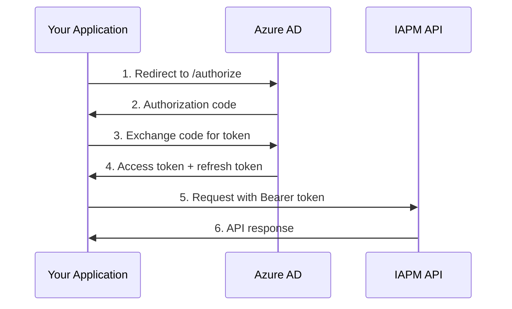

# Authentication

{!template/subscription-required.mdp!}

The IAPM API supports two authentication methods: OAuth 2.0 via Azure AD for user-context access, and API Keys for server-to-server integration.

## OAuth 2.0 (Azure AD)

OAuth 2.0 is the recommended authentication method for applications acting on behalf of a user. IAPM uses Azure Active Directory as the identity provider.

### Authorization Flow

IAPM uses the **Authorization Code flow with PKCE** for interactive applications and the **Client Credentials flow** for service-to-service communication.

#### Authorization Code Flow (Interactive)



#### Step 1 - Request Authorization

Direct the user to the Azure AD authorization endpoint:

```
https://login.microsoftonline.com/{tenantId}/oauth2/v2.0/authorize
  ?client_id=YOUR_CLIENT_ID
  &response_type=code
  &redirect_uri=https://your-app.com/callback
  &scope=api://iapm-api/.default
  &code_challenge=YOUR_PKCE_CHALLENGE
  &code_challenge_method=S256
```

#### Step 2 - Exchange Code for Token

```bash
curl -X POST "https://login.microsoftonline.com/{tenantId}/oauth2/v2.0/token" \
  -H "Content-Type: application/x-www-form-urlencoded" \
  -d "client_id=YOUR_CLIENT_ID" \
  -d "grant_type=authorization_code" \
  -d "code=AUTHORIZATION_CODE" \
  -d "redirect_uri=https://your-app.com/callback" \
  -d "code_verifier=YOUR_PKCE_VERIFIER"
```

**Response:**

```json
{
  "access_token": "YOUR_ACCESS_TOKEN",
  "token_type": "Bearer",
  "expires_in": 3600,
  "refresh_token": "YOUR_REFRESH_TOKEN",
  "scope": "api://iapm-api/.default"
}
```

#### Step 3 - Use the Access Token

Include the access token in the `Authorization` header:

```bash
curl -X GET "https://api-azure.iapm.app/apm/diagnostics/{gridSecondaryId}/health?api-version=2.0" \
  -H "Authorization: Bearer YOUR_ACCESS_TOKEN"
```

### Client Credentials Flow (Service-to-Service)

For automated scripts and backend services that don't act on behalf of a user:

```bash
curl -X POST "https://login.microsoftonline.com/{tenantId}/oauth2/v2.0/token" \
  -H "Content-Type: application/x-www-form-urlencoded" \
  -d "client_id=YOUR_CLIENT_ID" \
  -d "client_secret=YOUR_CLIENT_SECRET" \
  -d "grant_type=client_credentials" \
  -d "scope=api://iapm-api/.default"
```

### Token Refresh

Access tokens expire after the duration specified in `expires_in` (typically 3600 seconds). Use the refresh token to obtain a new access token without user interaction:

```bash
curl -X POST "https://login.microsoftonline.com/{tenantId}/oauth2/v2.0/token" \
  -H "Content-Type: application/x-www-form-urlencoded" \
  -d "client_id=YOUR_CLIENT_ID" \
  -d "grant_type=refresh_token" \
  -d "refresh_token=YOUR_REFRESH_TOKEN"
```

!!! tip "Token Caching"
    Cache access tokens and refresh them proactively before expiry. Avoid requesting a new token for every API call.

### Scopes

| Scope | Description |
|-------|-------------|
| `api://iapm-api/.default` | Full API access based on user's role permissions |

## API Key Authentication

API Keys provide a simpler authentication method for server-to-server integrations, automation scripts, and CI/CD pipelines.

### Getting Your API Key

1. Log in at [portal.iapm.app](https://portal.iapm.app){ target="_blank" }
2. Navigate to **Administration - Grids**
3. Click the **Instrument** button (:material-cog:) on your Grid
4. Copy the API key from the configuration wizard

See [API Keys](../Setup/Api-Key/index.md) for detailed instructions.

### Using Your API Key

Include the API key in the `API-Key` header:

```bash
curl -X GET "https://api-azure.iapm.app/apm/diagnostics/{gridSecondaryId}/health?api-version=2.0" \
  -H "API-Key: a1b2c3d4-e5f6-7890-abcd-ef1234567890"
```

!!! warning "API Key Security"
    - Never commit API keys to source control
    - Use environment variables or a secrets manager
    - Rotate keys periodically and immediately if compromised
    - Each Grid has its own API key - do not share keys across Grids

## Error Responses

### 401 Unauthorized

Returned when authentication is missing or the token/key is invalid.

```json
{
  "type": "https://tools.ietf.org/html/rfc7807",
  "title": "Unauthorized",
  "status": 401,
  "detail": "The access token has expired or is invalid."
}
```

**Common causes:**

- Missing `Authorization` or `API-Key` header
- Expired access token - refresh it and retry
- Malformed token string
- Revoked or regenerated API key

### 403 Forbidden

Returned when the authenticated identity lacks permission for the requested operation.

```json
{
  "type": "https://tools.ietf.org/html/rfc7807",
  "title": "Forbidden",
  "status": 403,
  "detail": "Owner role is required for this operation."
}
```

**Common causes:**

- Attempting to modify Grid limits without the Owner role
- Accessing a Grid the user is not a member of
- Client credentials without the required application permission
