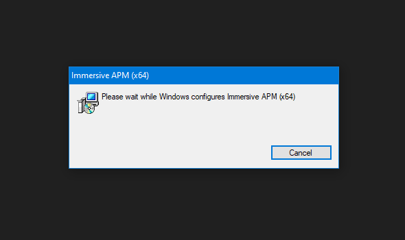

# Installing on Windows

[Latest Release Build](https://ifapm.blob.core.windows.net/release/rtm/msi/ImmersiveAPM.latest.msi){:class="md-button md-button--primary"}
[Latest Beta Build](https://ifapm.blob.core.windows.net/release/beta/msi/ImmersiveAPM.latest.msi){:class="md-button md-button--secondary"}
[Latest Alpha Build](https://ifapm.blob.core.windows.net/release/alpha/msi/ImmersiveAPM.latest.msi){:class="md-button"}

1. Click on the button above to download the installer for Immersive APM for Windows from the cloud. The file size is around `1GB`
    

1. Run the installer

    Navigate to your Downloads folder, click on the installer called `ImmersiveAPM.latest.msi` and run it.

    

    The installer for Immersive APM for Windows uses standard technology from Microsoft (MSI) and performs the installation silently without any unnecessary prompts.

    

1. Allow Installation (if User Account Control is enabled)

    The installer file needs to make minimal modifications to your computer as part of the installation process as well as store Immersive APM for Windows files.

    If you have User Account Control enabled on your computer, ensure that the prompt displays `Verified publisher: Immersive Fusion LLC`. Click `Yes` once you have done so to allow the installer to make modifications to your computer. Click `No`, if you don't see such a message on the prompt and contact us for assistance. 

    !!! info "UAC"
        User Account Control (UAC) is a security feature in Windows operating systems that helps prevent unauthorized changes to your computer or device by notifying you when a program tries to make changes that require administrator-level permission. When UAC is enabled, it prompts you to confirm whether you want to allow the program to make the requested changes. This helps protect your computer from malware and other security threats.

    If you do not have `User Account Control` enabled on your computer, ensure that the installer file is digitally signed by Immersive Fusion. Contact us if you need assistance.

    

1. Finish the installation
    
    Allow the installer to complete. This operation usually takes less than 30 seconds.

    
