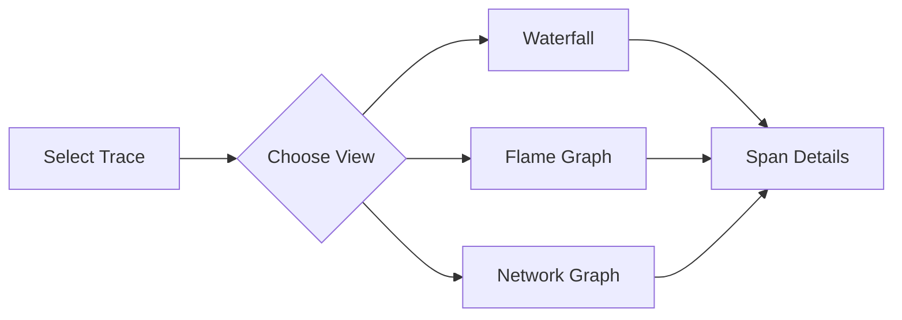
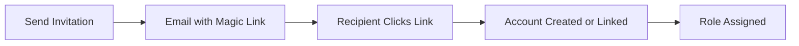

# IAPM Web Features

{!template/subscription-required.mdp!}

IAPM Web provides browser-based access to your application telemetry at [portal.iapm.app](https://portal.iapm.app){ target="_blank" }. The following features are available across all supported browsers.

## Observability

| Feature | Description |
|---------|-------------|
| **[Dashboard](#dashboard)** | Health scores, throughput, latency percentiles (P50/P95/P99), and error rates at a glance |
| **[Trace Analysis](#trace-analysis)** | Waterfall, flame graph, and network graph views with detailed span inspection |
| **[Log Search](#log-search)** | Full-text log search with structured filtering |

## AI Assistant

| Feature | Description |
|---------|-------------|
| **[Tessa Chat](#tessa)** | Streaming AI chat for diagnostics, root cause analysis, and guided troubleshooting |
| **[Voice Interaction](#tessa)** | Hands-free voice input for Tessa queries |
| **[Vision Support](#tessa)** | Send screenshots and images to Tessa for visual analysis |

## Platform Management

| Feature | Description |
|---------|-------------|
| **[Grid Management](#grid-management)** | Create, configure, and organize telemetry data containers |
| **[API Keys](#api-keys)** | Generate and rotate credentials for instrumentation endpoints |
| **[Personal Access Tokens](#personal-access-tokens)** | Scoped tokens with configurable expiration for API access |

## Account and Team

| Feature | Description |
|---------|-------------|
| **[Account Management](#account-management)** | Tenant configuration, billing profiles, and subscription management |
| **[Invitation System](#invitation-system)** | Magic-link invitations with role assignment (owner, member, user, guest) |
| **[Permissions](#permissions)** | Role-based access control across grids and account resources |
| **[Energy System](#energy-system)** | Track AI usage quotas per tier with per-grid and per-tenant breakdowns |

## Personalization

| Feature | Description |
|---------|-------------|
| **[Themes](#themes)** | Dark and light theme support across all components |
| **[Achievement Badges](#achievement-badges)** | Earn badges for platform milestones |
| **[GitHub Login](#authentication)** | Sign in with GitHub alongside Entra ID and local accounts |

---

## Feature Details

### Dashboard

The dashboard provides a real-time overview of application health. Key metrics include:

- **Health Score** - Composite score reflecting overall application status
- **Throughput** - Request volume over time
- **Latency** - Response time percentiles (P50, P95, P99)
- **Error Rate** - Percentage of failed requests

### Trace Analysis

Investigate distributed traces through multiple visualization modes:

- **Waterfall View** - Span timeline showing request flow and duration
- **Flame Graph** - Hierarchical view of execution time by service and operation
- **Network Graph** - Interactive service dependency map
- **Span Details** - Inspect individual span attributes, tags, and nested metadata

### Log Search

Search and filter logs with support for:

- Full-text search across log messages
- Structured field filtering (severity, service, timestamp)
- Correlation with traces and spans

### Tessa

Tessa is the AI Assistant built into IAPM Web, providing intelligent diagnostics through natural conversation.

- **Streaming Chat** - Real-time responses with live-streamed output
- **Voice Input** - Speak your questions for hands-free troubleshooting
- **Vision** - Attach screenshots or images for visual analysis alongside telemetry data
- **Context-Aware** - Tessa understands your current grid, traces, and application topology

!!! tip "Getting started with Tessa"
    Open the chat panel from any page and ask a question in plain language. Tessa has access to your traces, logs, and metrics within the current grid.

### Grid Management

Grids are telemetry data containers that organize your observability data. From the portal you can:

- Create and name new grids
- Configure data retention and ingestion settings
- Organize grids by team, environment, or application

### API Keys

API keys authenticate your instrumentation endpoints against IAPM. Manage keys from the portal:

- Create keys scoped to specific grids
- Rotate keys without downtime
- Revoke compromised credentials immediately

### Personal Access Tokens

Personal Access Tokens (PATs) provide scoped API access for automation and integrations:

- Define granular permission scopes
- Set expiration dates
- Manage active tokens from your account settings

### Account Management

Manage your organization's IAPM subscription:

- **Tenants** - Isolated environments for different teams or customers
- **Billing Profiles** - Payment methods and invoicing
- **Subscriptions** - Plan selection, upgrades, and usage tracking

### Invitation System

Invite team members with a streamlined magic-link flow:

Available roles:

| Role | Grids | API Keys | Team Management | Billing |
|------|:-----:|:--------:|:---------------:|:-------:|
| **Owner** | :material-check: | :material-check: | :material-check: | :material-check: |
| **Member** | :material-check: | :material-check: | :material-check: | |
| **User** | :material-check: | :material-check: | | |
| **Guest** | :material-check: | | | |

### Permissions

Role-based access control governs what each team member can see and do. Permissions are enforced across grids, API keys, account settings, and team management actions.

### Energy System

The energy system tracks AI Assistant usage across your subscription:

- View consumption by grid, tenant, and tier
- Monitor remaining quota for your billing period
- Source labels show which actions consume energy

### Themes

Switch between dark and light themes from your account settings. The selected theme applies across all pages and components.

### Achievement Badges

Earn badges as you reach platform milestones - from creating your first grid to analyzing your first trace.

### Authentication

IAPM Web supports multiple sign-in methods:

- **Entra ID** (Azure AD) - Enterprise single sign-on
- **GitHub** - Sign in with your GitHub account
- **Local Account** - Email and password

## Next Steps

| Action | Link |
|--------|------|
| Get started with IAPM Web | [Guides](../Guides/index.md) |
| Check browser support | [Supported Configurations](../Supported-Configurations/index.md) |
| View version history | [Release Notes](../release-notes.md) |
