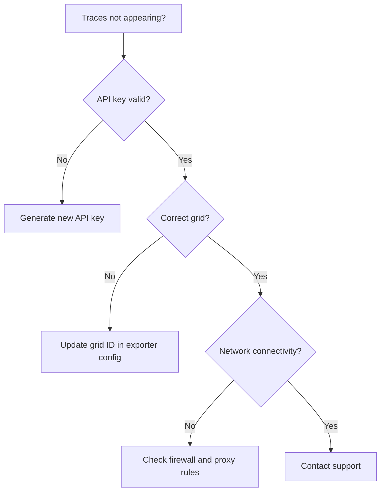
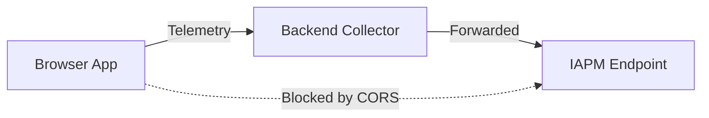

# Troubleshooting IAPM Web

{!template/subscription-required.mdp!}

Common issues and resolutions for IAPM Web at [portal.iapm.app](https://portal.iapm.app){ target="_blank" }.

## Quick Reference

| Symptom | Jump to |
|---------|---------|
| Cannot log in or authentication errors | [Login Issues](#login-issues) |
| Traces not appearing after instrumentation | [Traces Not Appearing](#traces-not-appearing) |
| Dashboard loads slowly or times out | [Slow Dashboard](#slow-dashboard) |
| API key returns 401 or 403 | [API Key Not Working](#api-key-not-working) |
| Team member did not receive invitation | [Invitation Emails Not Received](#invitation-emails-not-received) |
| Page rendering issues or blank screens | [Browser Compatibility](#browser-compatibility) |
| Instrumentation blocked by CORS policy | [CORS Errors](#cors-errors) |

---

## Login Issues

| Symptom | Cause | Resolution |
|---------|-------|------------|
| "Invalid credentials" error | Incorrect email or password | Reset your password from the login page. If using Entra ID, verify your directory credentials with your IT administrator. |
| Login page does not load | Browser cache or extension conflict | Clear browser cache and cookies, then retry. Disable ad blockers or privacy extensions temporarily. |
| GitHub login fails | GitHub account not linked | Ensure your GitHub email matches your IAPM account email. If you registered with a different method, link GitHub from your account settings. |
| Redirected back to login after authenticating | Session cookie blocked | Ensure third-party cookies are allowed for `portal.iapm.app`. Check that your browser is not in a restrictive privacy mode. |
| "Account not found" after Entra ID login | Tenant not provisioned | Your organization may not have an active IAPM subscription. Contact your account administrator or [support](https://immersivefusion.com/support). |

!!! tip "Entra ID users"
    If your organization enforces conditional access policies, ensure that `portal.iapm.app` is an allowed application in your Entra ID configuration.

---

## Traces Not Appearing

| Symptom | Cause | Resolution |
|---------|-------|------------|
| No traces visible after deploying instrumentation | API key misconfigured | Verify the API key in your instrumentation matches an active key for the target grid. See [API Key setup](../../../Setup/Api-Key/index.md). |
| Traces were visible but stopped appearing | API key expired or rotated | Check the API key status in the portal. Generate a new key if the current one was revoked. |
| Traces appear in one grid but not another | Instrumentation pointing to wrong grid | Confirm the grid ID in your exporter configuration matches the grid you are viewing. |
| Partial traces - some spans missing | Sampling or network issues | Check your sampling configuration. Ensure all services can reach the IAPM ingestion endpoint. |
| Traces appear with significant delay | Ingestion backlog | During high-volume periods, traces may take a few minutes to become searchable. If delays persist beyond 10 minutes, check your network connectivity. |

---

## Slow Dashboard

| Symptom | Cause | Resolution |
|---------|-------|------------|
| Dashboard takes over 10 seconds to load | Large time range selected | Narrow the time range filter. Start with the last 15 or 30 minutes. |
| Metrics charts render slowly | High cardinality data | Reduce the number of series by applying service or operation filters. |
| Browser becomes unresponsive on dashboard | Insufficient client resources | Close other tabs and applications. IAPM Web performs client-side rendering that benefits from available memory. |
| Dashboard loads but shows stale data | Browser cache serving old responses | Hard-refresh the page (Ctrl+Shift+R / Cmd+Shift+R) to bypass cache. |

!!! note "Recommended approach"
    For best performance, start with a narrow time window and expand as needed. Filtering by specific services or operations before loading the dashboard reduces query time.

---

## API Key Not Working

| Symptom | Cause | Resolution |
|---------|-------|------------|
| 401 Unauthorized response | Invalid or expired API key | Verify the key exists and is active in the portal under Grid Settings > API Keys. |
| 403 Forbidden response | Key does not have access to the target grid | Ensure the API key is scoped to the correct grid. Create a new key if the scope is wrong. |
| Key works in one environment but not another | Different keys per environment | Each environment (dev, staging, production) typically uses its own grid and API key. Verify you are using the correct key for each environment. |
| "Rate limited" response (429) | Too many requests in a short period | Implement backoff and retry logic in your exporter. Check your subscription tier for rate limits. |

---

## Invitation Emails Not Received

| Symptom | Cause | Resolution |
|---------|-------|------------|
| Invitee never received the email | Email filtered to spam/junk | Ask the invitee to check spam and junk folders for an email from IAPM. |
| Email bounced | Invalid email address | Verify the email address and resend the invitation from the team management page. |
| Invitee received the email but the link expired | Magic link has a time limit | Resend the invitation to generate a fresh magic link. |
| Invitation link shows "invalid or expired" | Link already used or revoked | Each magic link is single-use. If the invitee already clicked it, they should try logging in directly. If the invitation was revoked, resend it. |

!!! tip "Email deliverability"
    If your organization uses strict email filtering, add the IAPM sending domain to your allowlist. Contact your email administrator for details.

---

## Browser Compatibility

| Symptom | Cause | Resolution |
|---------|-------|------------|
| Blank white page after login | Unsupported browser version | IAPM Web requires a modern browser. See [Supported Configurations](../Supported-Configurations/index.md) for minimum versions. |
| UI elements misaligned or overlapping | Outdated CSS support | Update your browser to the latest version. |
| Charts or graphs do not render | WebGL or JavaScript disabled | Ensure JavaScript is enabled. Some visualizations require WebGL - verify it is enabled in your browser settings. |
| Features work in Chrome but not Safari | Browser-specific rendering differences | Update Safari to the latest version. If the issue persists, try Chrome or Edge as a workaround and report the issue. |

---

## CORS Errors

CORS (Cross-Origin Resource Sharing) errors occur when your instrumented application attempts to send telemetry from a browser context.

| Symptom | Cause | Resolution |
|---------|-------|------------|
| `Access-Control-Allow-Origin` error in browser console | Browser-based exporter sending directly to IAPM endpoint | Browser-based (front-end) applications should route telemetry through a backend collector or proxy rather than sending directly to the IAPM endpoint. |
| CORS error only in production | Different origin in production vs development | Verify that your production domain is configured correctly in your collector setup. |
| Preflight (OPTIONS) request fails | Firewall or proxy blocking OPTIONS requests | Ensure your network infrastructure allows HTTP OPTIONS requests to the IAPM ingestion endpoint. |

!!! warning "Browser instrumentation"
    Sending telemetry directly from browser JavaScript to the IAPM endpoint will trigger CORS errors. Use a backend OpenTelemetry Collector as a relay to avoid this issue.

---

## Still Need Help?

If your issue is not listed above or the suggested resolution does not work:

1. Check the [Release Notes](../release-notes.md) for known issues in your version
2. Visit [Supported Configurations](../Supported-Configurations/index.md) to verify your setup
3. Contact support at [immersivefusion.com/support](https://immersivefusion.com/support)
