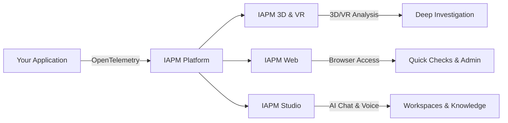

# IAPM

IAPM is available in three surfaces that work together to provide complete observability coverage. One product, three ways to access it - all backed by the same platform, same workspaces, same Tessa.

## Surface Comparison

| Feature | 3D & VR | Web | Studio |
|---------|---------|-----|--------|
| **Telemetry Data** | | | |
| Traces | Detailed | :material-check: | Via Tessa |
| Logs | Light | :material-check: | Via Tessa |
| Metrics | Minimal | :material-check: | Via Tessa |
| **Visualization** | | | |
| 3D Visualization | Full immersive | :material-close: | :material-close: |
| VR Headset Support | :material-check: | :material-close: | :material-close: |
| AI Assistant (Tessa) | :material-check: | :material-check: | :material-check: |
| **Collaboration** | | | |
| Workspaces + Artifacts | :material-check: | :material-close: | :material-check: |
| Org Knowledge | :material-check: | :material-close: | :material-check: |
| **Administration** | | | |
| Account Management | :material-close: | :material-check: | :material-close: |
| Mobile Access | :material-close: | :material-check: | :material-close: |

## IAPM (3D & VR)

The full immersive experience. A native application with 3D visualization, AI Assistant, and optional VR headset support.

[3D & VR :material-cube-outline:](3D/index.md){ .md-button .md-button--primary }

| Best For | Why |
|----------|-----|
| Deep-dive troubleshooting | Navigate through your application in 3D |
| Architecture reviews | Visualize service dependencies spatially |
| AI-assisted analysis | Natural chat with Tessa |
| VR enthusiasts | Full headset support |

## IAPM Web

Browser-based access to your telemetry data. Manage your account, configure alerts, and view traces from any device.

[Web :material-web:](Web/index.md){ .md-button }

| Best For | Why |
|----------|-----|
| Quick status checks | Instant access from any browser |
| Account management | Subscriptions, API keys, team settings |
| Alert configuration | Set up and manage notifications |
| Mobile monitoring | Access from phone or tablet |

## IAPM Studio

!!! warning "Early Access"
    IAPM Studio is in early access. Features and availability may change.

Lightweight native client for AI-powered chat, voice interaction, workspaces, and organizational knowledge - without the full 3D environment.

[Studio :material-chat:](Studio/index.md){ .md-button }

| Best For | Why |
|----------|-----|
| AI-powered analysis | Chat and voice with Tessa |
| Workspace management | Artifacts, org knowledge |
| Lightweight access | No 3D rendering overhead |

## How They Work Together

Most teams use multiple surfaces: IAPM Web for account management and quick status checks, IAPM (3D & VR) for detailed troubleshooting and immersive analysis, and IAPM Studio for AI-powered workflows and organizational knowledge.
