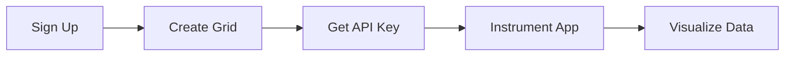

# Getting Started

Get up and running with IAPM in minutes. This guide walks you through account setup, application instrumentation, and your first visualization.

## Choose Your Login Method

Select how you want to authenticate with IAPM:

[Microsoft Entra ID :material-microsoft:](Step-By-Step-Instructions/Entra-ID/index.md){ .md-button .md-button--primary }
[Local or Social Account :material-account:](Step-By-Step-Instructions/Local-and-Social/index.md){ .md-button }

| Option | Best For | Identity Providers |
|--------|----------|-------------------|
| **Entra ID** | Organizations using Microsoft 365 or Azure | Microsoft work/school accounts, SSO |
| **Local/Social** | Individual developers, non-Microsoft environments | Email, Google, GitHub |

Both options provide identical features and pricing.

!!! info "Free to Start"
    New accounts start on the free **Start** plan. No credit card required. See [Plans & Pricing](../Setup/Plans/index.md) for all options.

## Quick Start Overview

| Step | Action | Time |
|------|--------|------|
| 1 | Sign up and configure your account | 2 min |
| 2 | Create a grid (telemetry container) | 1 min |
| 3 | Copy your API key | 30 sec |
| 4 | Add OpenTelemetry to your application | 5-15 min |
| 5 | Deploy and explore your data | Immediate |

## Try Before You Instrument

Not ready to instrument your own application? Explore IAPM with pre-loaded demo data:

[Open Sandbox :material-flask:](../Setup/Sandbox/index.md){ .md-button .md-button--primary }

The sandbox provides a fully-functional environment with sample traces, metrics, and logs.

## Explore Your Data

Once your application is sending telemetry, choose how to visualize:

| Product | Description | Access |
|---------|-------------|--------|
| **IAPM Web** | Browser-based dashboards, account management, alerts | [Learn more](../Products/IAPM-Web/index.md) |
| **IAPM Desktop** | Full 3D visualization with optional VR support | [Learn more](../Products/IAPM-Desktop/index.md) |

## Need Help?

| Channel | Best For |
|---------|----------|
| [Live Chat](javascript:zE.activate()) | Quick questions, immediate support |
| [Discord](https://discord.gg/zevywnQp6K){ target="_blank" } | Community help, feature discussions |
| [YouTube](https://www.youtube.com/@immersivefusion){ target="_blank" } | Video tutorials, walkthroughs |
| [Contact Us](../contact.md) | Sales, licensing, enterprise support |
