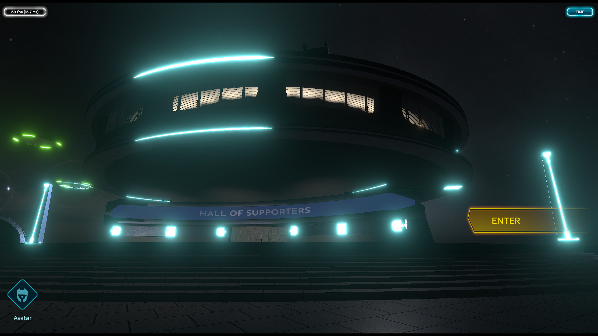
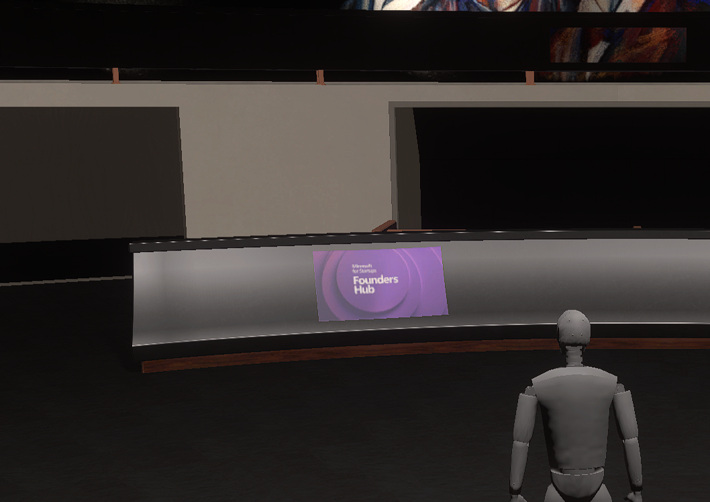
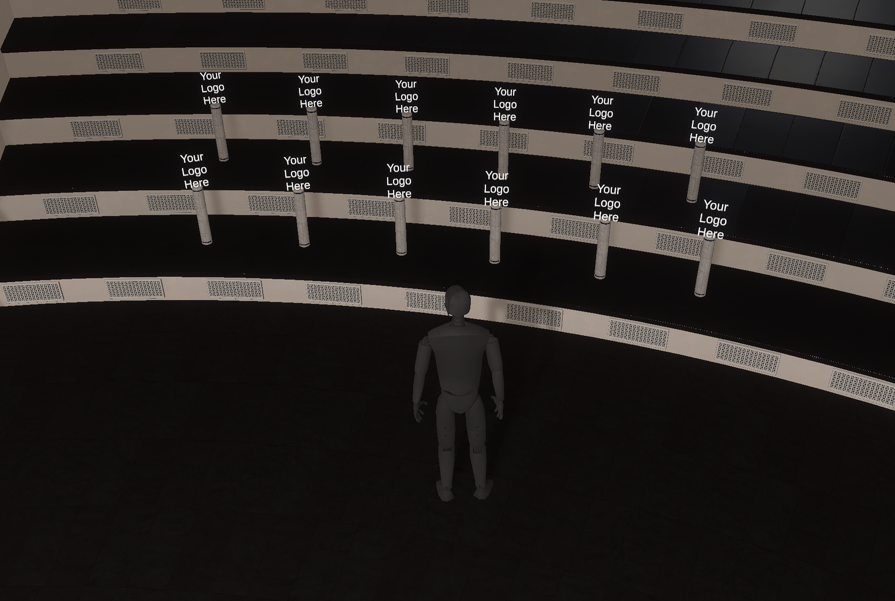
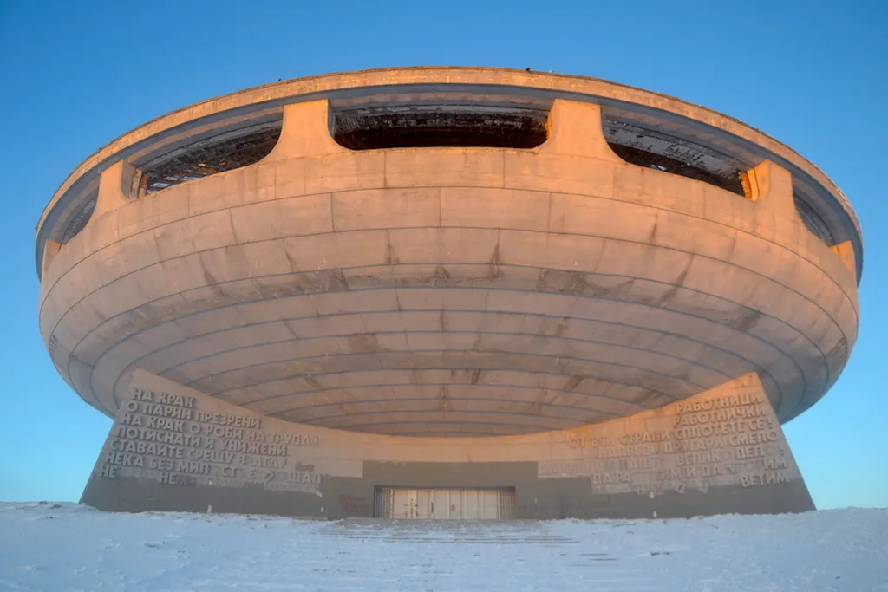

# Hall of Supporters

Partners need to be recognized. Participating in a fundraiser campaign, time or financial contributions that is not part of your subscription cost for Immersive APM adds to a total amount contributed by partner. Based on the total value you contributed, you can choose to be featured in the Immersive APM Hall of Supporters.

The Hall of Supporters is a special location in the Immersive APM 3D/VR world. There, your company logo will be shown for everyone to see and appreciate that you are a vital part of the Immersive Fusion journey. This isn’t just a static display—it’s a vibrant, monument to collaboration, glowing with the energy of those who’ve fueled the mission. Picture a colossal, prismatic dome suspended in a starlit void, its walls shimmering with dynamic holograms of partner logos that pulse and shift, each one telling a story of commitment. The larger the contribution, the more prominent the display—logos scaling in size, radiating with bespoke animations that reflect your brand’s essence, from fiery trails for bold innovators to serene orbits for steadfast visionaries.

Step inside, and the Hall becomes a museum of milestones. Artifacts from the Immersive APM journey float in mid-air: crystalline data shards etched with the code of our first prototype, holographic blueprints of the platform’s evolution, and shimmering orbs that replay key moments—like the day we hit our first million users or launched VR integration. Each artifact is tagged with the names of partners who made those victories possible, their contributions immortalized in light and sound. Visitors can interact, zooming into timelines that weave your story into ours, showcasing how your support shaped the tech that’s redefining asset performance management.

This isn’t just a thank-you; it’s a legacy. The Immersive APM Hall of Supporters is where your mark on the future is seen, felt, and remembered—a dazzling tribute to those who dared to build the next era of industry with us.

## Embracing history, showing appreciation and looking forward

The [Buzludja Monument](https://www.google.com/search?q=Buzludja+Monument){:target=g}, reimagined as the Hall of Supporters in Immersive Fusion’s 3D/VR world, is a powerful symbol of renewal, bridging a historic vision of asset performance management (APM) with a revolutionary new approach. Originally built in 1981 to political roots, the monument’s bold, futuristic architecture evokes a sense of ambition and grandeur. In its virtual incarnation, it transcends its political past, becoming a dynamic tribute to innovation, partnership, and forward-thinking. This transformation aligns seamlessly with the Hall of Supporters’ story, showcasing revolutionaries, appreciating the monument’s architectural legacy, culturally iconic figures and embracing revolutionary future unburdened by outdated ideologies.
