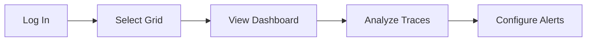

# IAPM Web

Browser-based access to your application telemetry. No installation required - access from any device with a modern browser.

[Launch IAPM Web (Entra ID) :material-microsoft:](https://azure.iapm.app){ .md-button .md-button--primary target="_blank" }
[Launch IAPM Web (Local/Social) :material-account:](https://my.iapm.app){ .md-button target="_blank" }

## Key Capabilities

| Feature | Description |
|---------|-------------|
| **Dashboards** | Monitor application health, latency, throughput, and error rates |
| **Trace Analysis** | Span waterfall view, network graphs, and flame graphs |
| **Grid Management** | Create, configure, and organize telemetry data containers |
| **API Keys** | Generate and manage credentials for instrumentation |
| **Account Management** | Subscriptions, billing, team members, and settings |
<!-- | **Alerts** | Configure notifications for performance thresholds | -->

## IAPM Web vs Desktop

| Use Case | IAPM Web | IAPM Desktop |
|----------|:--------:|:------------:|
| Quick status check | :material-check: | |
| Account management | :material-check: | |
| API key generation | :material-check: | |
| Trace waterfall view | :material-check: | :material-check: |
| Deep troubleshooting | | :material-check: |
| 3D visualization | | :material-check: |
| AI Assistant | Coming soon | :material-check: |
| VR immersion | | :material-check: |

## Getting Started

1. **Log in** - Choose your authentication method (Entra ID or Local/Social)
2. **Select a grid** - Choose an existing grid or create a new one
3. **Explore** - Click **Enter** to view your application telemetry

## Recent Features

| Feature | Description |
|---------|-------------|
| Span View Tab | Waterfall timeline for detailed span analysis |
| Network Graph | Interactive service dependency visualization |
| Nested Span Tags | Collapsible tree view for hierarchical data |
| Dark/Light Themes | Full theme support across all components |

See [Release Notes](release-notes.md) for complete version history.

## Next Steps

| Action | Link |
|--------|------|
| View detailed guides | [IAPM Web Guides](Guides/index.md) |
| Check browser support | [Supported Browsers](Supported-Configurations/index.md) |
| Instrument your app | [Instrumentation Guide](../../Setup/Custom-application/Instrument-your-application/index.md) |
| Try 3D visualization | [IAPM Desktop](../IAPM-Desktop/index.md) |
