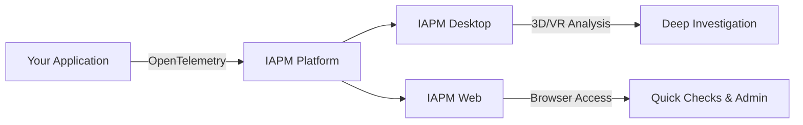

# Products

IAPM is available in two editions that work together to provide complete observability coverage.

## Product Comparison

| Feature | IAPM Desktop | IAPM Web |
|---------|--------------|----------|
| **Telemetry Data** | | |
| Traces | Detailed | :material-check: |
| Logs | Light | :material-check: |
| Metrics | Minimal | :material-check: |
| **Visualization** | | |
| 3D Visualization | Full immersive | :material-close: |
| VR Headset Support | :material-check: | :material-close: |
| AI Copilot | :material-check: | Coming soon |
| Dashboards | In-world views | Traditional |
| **Administration** | | |
| Account Management | :material-close: | :material-check: |
| Mobile Access | :material-close: | :material-check: |

## IAPM Desktop

The full immersive experience. A desktop application with 3D visualization, AI Copilot, and optional VR headset support.

[IAPM Desktop :material-cube-outline:](IAPM-Desktop/index.md){ .md-button .md-button--primary }

| Best For | Why |
|----------|-----|
| Deep-dive troubleshooting | Navigate through your application in 3D |
| Architecture reviews | Visualize service dependencies spatially |
| AI-assisted analysis | Natural chat with AI Copilot |
| VR enthusiasts | Full headset support |

## IAPM Web

Browser-based access to your telemetry data. Manage your account, configure alerts, and view dashboards from any device.

[IAPM Web :material-web:](IAPM-Web/index.md){ .md-button }

| Best For | Why |
|----------|-----|
| Quick status checks | Instant access from any browser |
| Account management | Subscriptions, API keys, team settings |
| Alert configuration | Set up and manage notifications |
| Mobile monitoring | Access from phone or tablet |

## How They Work Together

Most teams use both products: IAPM Web for account management and quick status checks, IAPM Desktop for detailed troubleshooting and immersive analysis.
