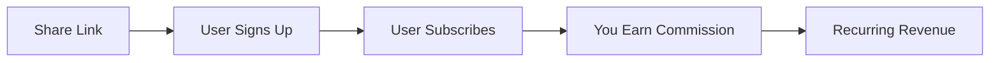

# Affiliate Program

Earn commissions by sharing IAPM with your network. Our affiliate program offers transparent, usage-based rewards for helping organizations discover the power of 3D/VR application performance management.

## Program Highlights

| Feature | Description |
|---------|-------------|
| **Usage-Based Commissions** | Earn recurring revenue tied to referred customer usage |
| **Transparent Portal** | Real-time tracking of referrals, conversions, and earnings |
| **Marketing Resources** | Branded demos, infographics, and shareable content |
| **Recognition** | Top affiliates featured in the [Hall of Supporters](../Hall-of-Supporters/index.md) |

## How It Works

1. **Sign up** for the affiliate program
2. **Get your unique referral links** from the affiliate portal
3. **Share** with your audience through blogs, social media, or direct outreach
4. **Track conversions** in real-time on your dashboard
5. **Earn commissions** on every subscription and usage milestone

## Commission Structure

Commissions scale with your referrals' engagement:

| Referral Action | Commission Type |
|-----------------|-----------------|
| Free trial sign-up | Bonus on conversion |
| Subscription purchase | Percentage of first payment |
| Ongoing usage | Recurring percentage |
| Feature upgrades | Additional bonus |

## Promotional Tools

### Available Offers

| Offer Type | Description |
|------------|-------------|
| **Free Trial Links** | Let users experience IAPM risk-free |
| **Subscription Discounts** | Special offers on Starter, Professional, and Enterprise plans |
| **Feature Campaigns** | Highlight specific capabilities like AI diagnostics or VR visualization |
| **Event Promotions** | Time-limited bonuses tied to product launches |

### Marketing Resources

We provide everything you need to succeed:

- Branded VR demos and screenshots
- ROI infographics (e.g., "25% downtime reduction")
- Social media templates
- Case study content from the [Hall of Supporters](../Hall-of-Supporters/index.md)
- Co-marketing opportunities (webinars, guest posts)

## Affiliate Portal

Your dedicated dashboard provides:

- **Real-time tracking** - See clicks, conversions, and earnings as they happen
- **Referral journey** - Follow each lead from click to conversion
- **Commission calculator** - Transparent breakdown of your earnings
- **Performance analytics** - Identify your most effective channels
- **Payout history** - Track all payments and pending commissions

## Recognition and Rewards

### Hall of Supporters

Top-performing affiliates earn:

- Featured placement in the virtual [Hall of Supporters](../Hall-of-Supporters/index.md)
- Invitations to exclusive VR events
- Networking opportunities with partners and customers
- Enhanced commission tiers

## Who Should Join?

The affiliate program is ideal for:

- **Content Creators** - Tech bloggers, YouTubers, podcasters
- **Consultants** - DevOps, SRE, and observability consultants
- **Industry Influencers** - Thought leaders in APM, cloud, and VR
- **Technology Partners** - Companies with complementary offerings
- **Developer Advocates** - Those passionate about developer tools

## Get Started

Ready to start earning? Sign up for the affiliate program today.

[Sign Up Now :material-arrow-right:](https://immersivefusion.trackdesk.com/sign-up){ .md-button .md-button--primary target="_blank" }

Questions? Contact us at [affiliates@immersivefusion.com](mailto:affiliates@immersivefusion.com).
