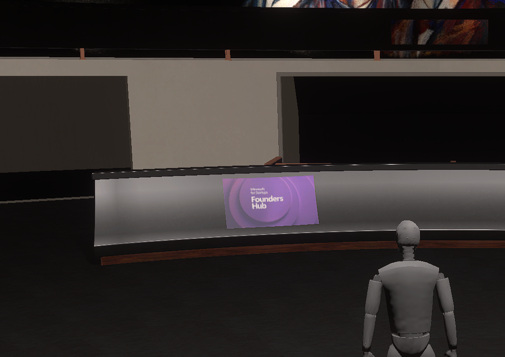
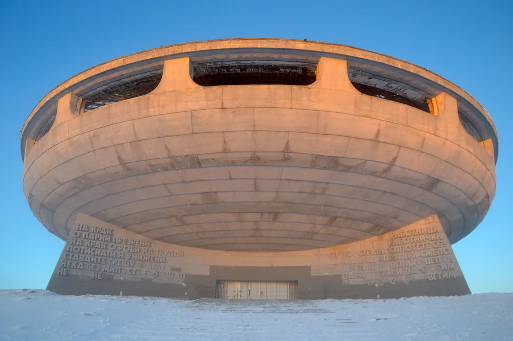

# Hall of Supporters

The Hall of Supporters is a unique virtual space within IAPM where partners and contributors are permanently recognized. Your contributions—whether financial, technical, or advocacy—earn you a place in this immersive monument to collaboration.

## What is the Hall of Supporters?

The Hall of Supporters is a special location in the IAPM 3D/VR world—a vibrant monument glowing with the energy of those who've fueled our mission. Picture a colossal, prismatic dome suspended in a starlit void, its walls shimmering with dynamic holograms of partner logos that pulse and shift.

### Recognition Tiers

| Contribution Level | Display Features |
|-------------------|------------------|
| **Supporter** | Logo displayed in the Hall |
| **Partner** | Larger logo with custom animation |
| **Founders' Tier** | Premium placement, Journey Wall feature, interactive vignette |

The larger your contribution, the more prominent your display—logos scale in size with bespoke animations that reflect your brand's essence.

## Inside the Hall

Step inside, and the Hall becomes a museum of milestones:

- **Floating Artifacts** - Crystalline data shards and holographic blueprints of IAPM's evolution
- **Interactive Timeline** - Key moments tagged with the partners who made them possible
- **Journey Wall** - Immersive vignettes showcasing partner stories and impact

Each artifact is tagged with the names of partners who made those victories possible—contributions immortalized in light and sound. Visitors can interact, zooming into timelines that weave your story into ours.

## Your Place in History

This isn't just a thank-you; it's a legacy. The Hall of Supporters is where your mark on the future is seen, felt, and remembered—a tribute to those who dared to build the next era of application performance management with us.

## The Inspiration

The Hall's design draws inspiration from the [Buzludja Monument](https://www.google.com/search?q=Buzludja+Monument){ target="_blank" }, reimagined for the digital age. Originally built in 1981, the monument's bold, futuristic architecture evokes ambition and grandeur. In its virtual incarnation, it transcends its origins to become a dynamic tribute to innovation, partnership, and forward-thinking.

## How to Be Featured

Contributions that qualify for Hall of Supporters recognition include:

- Participating in fundraiser campaigns
- Financial contributions beyond subscription costs
- Technical contributions and expertise
- Significant advocacy and community building

Ready to join the Hall?

[Become a Benefactor :material-arrow-right:](../Benefactors/index.md){ .md-button }
[Contact Us :material-arrow-right:](mailto:partners@immersivefusion.com){ .md-button }
