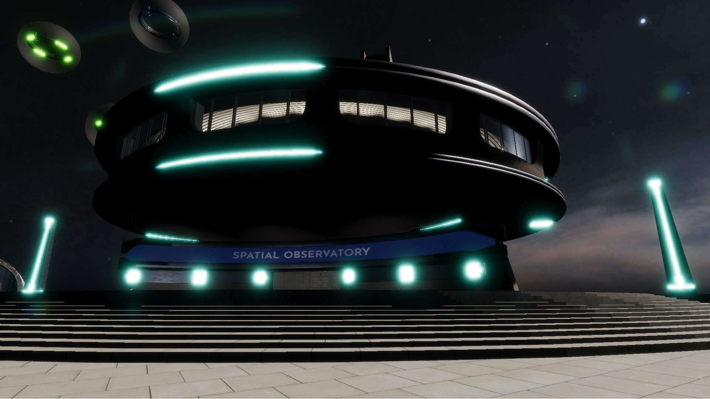

# Spatial Observatory

The Spatial Observatory is the commons of the world your application lives in. It is open to everyone: no subscription, no fee, nothing to prove at the door.

## Where the invisible is made visible

The work of running software, and the people who do it, tend to go unseen. The Spatial Observatory is organized around the opposite premise. The systems that keep software alive are rendered there in full spatial dimension, and the people who run those systems are seen.

Two groups are recognized in the Observatory:

- **The supporters** who helped build this category before there was proof it would work.
- **The Users** who do the work in production, with real stakes.

## Open to all

Entry is open. There is no tier to reach, no contribution to make, and no credential to hold before you can walk in. Recognition inside the Observatory is earned through the work, never bought through the size of a contribution.

Entry is open. Recognition is earned. These are different things, and both matter.

## Come in

The Spatial Observatory grows as the community does. The building tells its own story once you are inside.

[Explore Spatial Observability :material-arrow-right:](../../Terms-and-Concepts/Spatial-Observability/index.md){ .md-button }
[Contact Us :material-arrow-right:](mailto:partners@immersivefusion.com){ .md-button }
