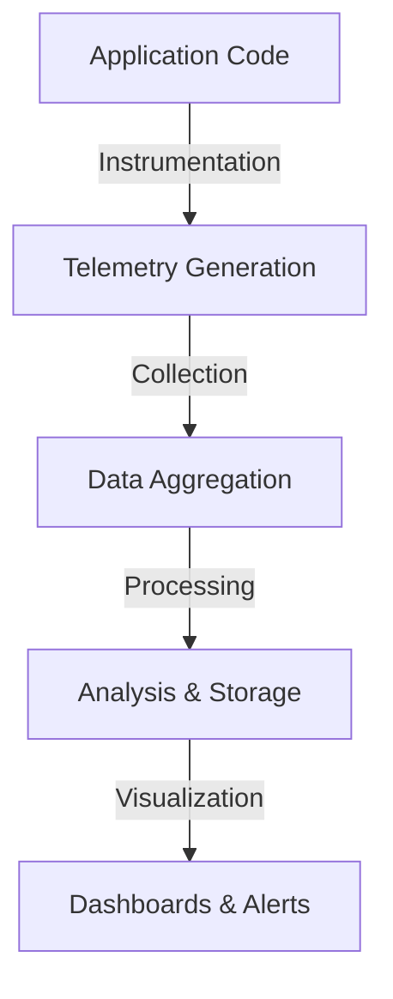

# Application Performance Management (APM)

Application Performance Management (APM) is the practice of monitoring, managing, and optimizing the performance and availability of software applications. APM provides visibility into how applications behave in production, helping teams identify bottlenecks, diagnose issues, and ensure optimal user experiences.

## Why APM Matters

Modern applications are complex distributed systems with many moving parts. Without proper monitoring:

- **Performance issues go undetected** until users complain
- **Root cause analysis** becomes a time-consuming guessing game
- **Capacity planning** relies on assumptions rather than data
- **SLA compliance** cannot be measured or guaranteed

## Key Capabilities

APM solutions provide several critical capabilities:

### Real-Time Monitoring

Track application health metrics as they happen:

- Response times and latency
- Throughput and request rates
- Error rates and exceptions
- Resource utilization (CPU, memory, I/O)

### Distributed Tracing

Follow requests as they flow through your system:

- Service-to-service communication
- Database queries and external API calls
- Queue processing and async operations

### Alerting and Diagnostics

Get notified when things go wrong:

- Threshold-based alerts
- Anomaly detection
- Automated root cause analysis

## What APM Monitors

| Application Type | Examples |
|------------------|----------|
| Web Applications | REST APIs, GraphQL endpoints, web servers |
| Mobile Applications | iOS and Android apps, mobile backends |
| Databases | SQL, NoSQL, caching layers |
| Cloud Services | Serverless functions, containers, microservices |
| Infrastructure | Servers, networks, storage systems |

## The APM Data Pipeline

1. **[Instrumentation](../Instrumentation/index.md)** - Code is instrumented to emit telemetry
2. **[Collection](../Collection/index.md)** - Telemetry data is gathered and transmitted
3. **[Correlation](../Correlation/index.md)** - Related data points are connected
4. **Visualization** - Insights are presented in actionable formats

## APM vs. Observability

While APM focuses on application performance, [observability](../Observability/index.md) is a broader concept that encompasses the ability to understand a system's internal state from its external outputs. APM is a key component of an observability strategy, working alongside logging, metrics, and tracing to provide complete system visibility.

## Next Steps

- Learn about [Observability](../Observability/index.md) and the three pillars
- Understand how [IAPM](../IAPM/index.md) enhances traditional APM with immersive visualization
- Explore [Instrumentation](../Instrumentation/index.md) to start collecting telemetry
