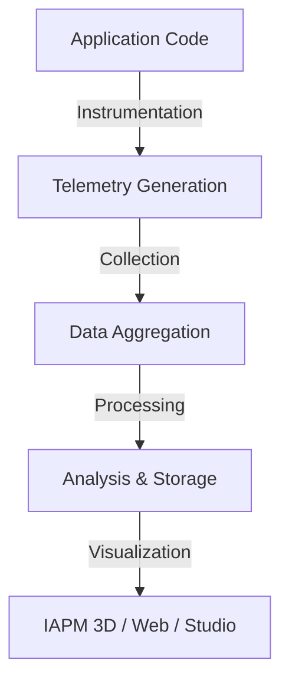

# Application Performance Management (APM)

Application Performance Management (APM) is the practice of monitoring, managing, and optimizing the performance and availability of software applications. IAPM takes APM into a new dimension - literally - by replacing dashboard fatigue with immersive 3D visualization and AI-powered diagnostics.

## Why APM Matters

Modern applications are distributed systems with dozens of services. Without APM:

- **Performance issues go undetected** until users complain
- **Root cause analysis** becomes a time-consuming guessing game
- **Capacity planning** relies on assumptions rather than data
- **SLA compliance** cannot be measured or guaranteed

## The APM Data Pipeline

```mermaid
graph TD
    A[Application Code] -->|Instrumentation| B[Telemetry Generation]
    B -->|Collection| C[Data Aggregation]
    C -->|Processing| D[Analysis & Storage]
    D -->|Visualization| E[IAPM 3D / Web / Studio]
```

1. **[Instrumentation](../Instrumentation/index.md)** - Your code emits traces, metrics, and logs via OpenTelemetry
2. **[Collection](../Collection/index.md)** - Telemetry is exported to IAPM (directly or via Collector)
3. **[Correlation](../Correlation/index.md)** - Related data points are connected across services
4. **Visualization** - Insights surfaced in 3D, browser, or AI chat

## How IAPM Is Different

| Aspect | Traditional APM | IAPM |
|--------|----------------|------|
| **Interface** | Dashboards and query languages | 3D spatial environment |
| **Root cause analysis** | Manual log correlation | Tessa AI diagnoses and suggests fixes |
| **Instrumentation** | Proprietary agents | Standard OpenTelemetry (no lock-in) |
| **Query complexity** | Complex DSL required | Ask Tessa in natural language |
| **Collaboration** | Siloed dashboard views | Shared immersive space |
| **Pricing** | Per-host + per-GB + per-feature | Simple per-node pricing |

Traditional APM tools (Datadog, Dynatrace, New Relic) give you dashboards. IAPM lets you step inside your system, fly through your service topology, and ask Tessa what's wrong.

## APM vs. Observability

APM focuses on application performance. [Observability](../Observability/index.md) is broader - it encompasses the ability to understand a system's internal state from its external outputs. APM is a key component of observability, working alongside logging, metrics, and tracing to provide complete system visibility.

## Next Steps

- Learn about [Observability](../Observability/index.md) and the three pillars
- Understand how [IAPM](../IAPM/index.md) enhances APM with immersive visualization
- [Instrument your application](../../../Instrument/index.md) to start collecting telemetry
