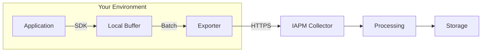

# Data Collection

Data collection is the process of gathering telemetry from your instrumented applications and transmitting it to IAPM for analysis and visualization. Understanding how collection works helps you optimize performance and ensure reliable telemetry delivery.

## The Collection Pipeline



## What Gets Collected

IAPM collects three types of telemetry data:

| Data Type | Description | Examples |
|-----------|-------------|----------|
| **Traces** | Request paths through your system | API calls, database queries, service-to-service communication |
| **Metrics** | Numeric measurements over time | Response times, error rates, throughput, resource utilization |
| **Logs** | Discrete events with context | Errors, warnings, audit events, debug information |

## Collection Methods

### Direct Export

Your application sends telemetry directly to IAPM:

```text
Application → SDK → IAPM Endpoint
```

**Best for:** Simple deployments, single applications, development environments

### Collector-Based

A local collector receives, processes, and forwards telemetry:

```text
Application → SDK → OTel Collector → IAPM Endpoint
```

**Best for:** Production environments, multiple applications, advanced processing needs

## Key Concepts

### Batching

Telemetry is grouped into batches before transmission to reduce network overhead:

- **Batch size** - Number of items per batch
- **Batch timeout** - Maximum time before sending a partial batch
- **Queue size** - Buffer capacity for pending telemetry

### Sampling

For high-volume applications, sampling reduces data volume while maintaining visibility:

| Strategy | Description | Use Case |
|----------|-------------|----------|
| Head-based | Decide at request start | Consistent sampling rate |
| Tail-based | Decide after request completes | Keep interesting traces (errors, slow requests) |
| Probabilistic | Random percentage | General volume reduction |

### Retry and Reliability

IAPM collection handles transient failures gracefully:

- **Automatic retries** - Failed transmissions are retried with exponential backoff
- **Persistent queuing** - Data is buffered during outages
- **Backpressure** - Collection slows when downstream systems are overwhelmed

## Data Security

Telemetry data often contains sensitive information. IAPM ensures security through:

- **Encryption in transit** - All data transmitted over HTTPS/TLS
- **Attribute filtering** - Remove or mask sensitive fields before export
- **Access controls** - Role-based access to telemetry data

## Performance Considerations

Optimize collection to minimize impact on your application:

| Setting | Impact | Recommendation |
|---------|--------|----------------|
| Batch size | Larger batches = fewer requests, more memory | Start with defaults, tune based on volume |
| Export interval | Shorter = fresher data, more overhead | 5-30 seconds for most workloads |
| Queue size | Larger = better burst handling, more memory | Size for expected peak volume |

## Next Steps

- Learn about [Instrumentation](../Instrumentation/index.md) - How to generate telemetry
- Understand [Correlation](../Correlation/index.md) - How collected data is connected
- Review [OpenTelemetry](../Observability/Frameworks/OpenTelemetry/index.md) - The collection framework
