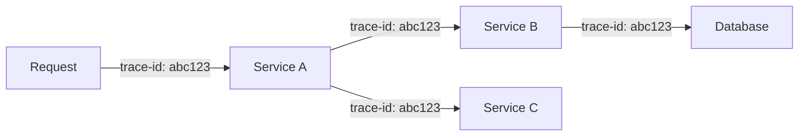

# Correlation

Correlation is the process of connecting related telemetry data across traces, metrics, and logs. When telemetry is properly correlated, you can seamlessly navigate from a metric anomaly to the specific traces and logs that explain what happened.

## Why Correlation Matters

Without correlation, troubleshooting looks like this:

1. Alert fires for high error rate
2. Search logs for errors around that time
3. Guess which requests might be related
4. Manually piece together the story

With correlation:

1. Alert fires for high error rate
2. Click through to see exactly which traces had errors
3. View the logs for those specific requests
4. Understand root cause in minutes

## How Correlation Works

### Trace Context Propagation

Every request gets a unique trace ID that follows it through your system:



All telemetry generated during that request includes the same trace ID, making it easy to find related data.

### Correlation Identifiers

| Identifier | Scope | Purpose |
|------------|-------|---------|
| **Trace ID** | Entire request | Links all operations for a single request |
| **Span ID** | Single operation | Identifies a specific operation within a trace |
| **Parent Span ID** | Operation relationship | Shows which operation called which |

### Linking Telemetry Types

IAPM automatically correlates:

| From | To | How |
|------|----|-----|
| Trace → Logs | Logs emitted during a span | Trace ID and Span ID in log context |
| Trace → Metrics | Metrics with trace exemplars | Exemplar links to representative traces |
| Logs → Trace | Log entries to their request | Trace ID extracted from log attributes |

## Correlation in Practice

### Scenario: Debugging a Slow Request

```text
1. Dashboard shows P99 latency spike
   └─ Click metric to see exemplar traces

2. View trace with 2.5s duration
   └─ See span breakdown: Auth(50ms) → API(100ms) → DB(2300ms)

3. Click slow database span
   └─ View correlated logs: "Query timeout after 2000ms"

4. Root cause identified: Missing index on customer_id column
```

### Scenario: Investigating an Error

```text
1. Error rate alert fires
   └─ View affected traces

2. Trace shows failure in Payment Service
   └─ Span has error flag and exception details

3. View correlated logs
   └─ Full stack trace and request context

4. Root cause identified: Third-party API timeout
```

## Enabling Correlation

### Automatic Correlation

OpenTelemetry SDKs automatically:

- Generate and propagate trace context
- Inject trace IDs into logs (with proper configuration)
- Add correlation attributes to metrics

### Manual Correlation

For custom telemetry, include correlation context:

```csharp
// Add trace context to custom logs
logger.LogInformation("Processing order {OrderId}", orderId);
// SDK automatically adds trace_id and span_id when configured
```

## Best Practices

### Do

- **Configure log correlation** - Ensure your logging framework includes trace context
- **Use structured logging** - Makes correlation queries more effective
- **Propagate context** - Pass trace headers to all downstream services
- **Add business context** - Include relevant IDs (user, order, session) in spans

### Avoid

- **Breaking context propagation** - Don't lose trace headers in async operations
- **Over-relying on timestamps** - Time-based correlation is fragile; use trace IDs
- **Ignoring sampling** - Ensure correlated data has matching sampling decisions

## IAPM Correlation Features

IAPM enhances correlation with:

- **Automatic log-trace linking** - View logs inline with trace spans
- **Metric exemplars** - Jump from metrics to representative traces
- **Service maps** - Visualize how services correlate in your architecture
- **Cross-service queries** - Search across all telemetry types simultaneously

## Next Steps

- Learn about [Observability](../Observability/index.md) - The three pillars that get correlated
- Understand [Instrumentation](../Instrumentation/index.md) - How to emit correlated telemetry
- Explore [OpenTelemetry](../Observability/Frameworks/OpenTelemetry/index.md) - The framework powering correlation
