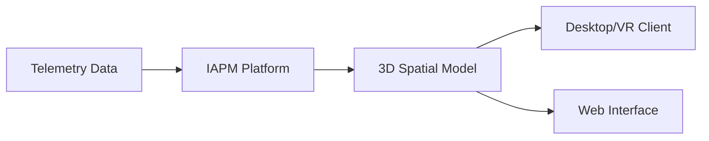

# Immersive APM (IAPM)

**Immersive APM** is Immersive Fusion's approach to [Application Performance Management](../APM/index.md) that uses 3D visualization and optional VR to help engineers understand complex distributed systems.

## The Challenge with Traditional APM

Modern applications are complex. A single user request might touch dozens of services, databases, and external APIs. Traditional APM tools present this complexity through:

- Flat dashboards with disconnected charts
- Service maps that become unreadable at scale
- Tab-switching to compare different views
- Time-consuming mental model reconstruction

## The IAPM Solution

IAPM transforms how you understand your systems by rendering your application architecture as an interactive 3D environment:

## Key Characteristics

| Feature | Description |
|---------|-------------|
| **3D Visualization** | Application topology rendered in three dimensions with spatial relationships |
| **Real-Time Data** | Live telemetry via [OpenTelemetry](../Observability/Frameworks/OpenTelemetry/index.md) |
| **AI-Assisted** | AI Assistant for root cause analysis and anomaly explanation |
| **VR-Ready** | Optional immersive headset support for deep exploration |
| **Collaborative** | Multiple team members can explore the same environment |

## How It Differs from Traditional APM

| Aspect | Traditional APM | Immersive APM |
|--------|-----------------|---------------|
| **Visualization** | 2D dashboards and graphs | 3D spatial environment |
| **Context** | Switch between multiple views | Unified visual context |
| **Navigation** | Query-based exploration | Fly-through navigation |
| **Alerts** | Text-based notifications | Visual anomaly highlighting |
| **Scale** | Cluttered at high complexity | Spatial layout handles scale |
| **Collaboration** | Screen sharing | Shared virtual space |

## Use Cases

### Incident Response

Navigate directly to problem areas highlighted in red. See upstream and downstream dependencies instantly. Understand blast radius at a glance.

### Architecture Review

Walk through your system topology. Identify unexpected dependencies. Spot single points of failure visually.

### Onboarding

New team members can explore the architecture interactively. Build mental models faster through spatial understanding.

### Capacity Planning

Visualize traffic patterns and resource utilization. See where bottlenecks are likely to form.

## Products

| Product | Description | Best For |
|---------|-------------|----------|
| [IAPM Desktop](../../../Products/IAPM-Desktop/index.md) | Full 3D/VR client application | Deep investigation, VR immersion |
| [IAPM Web](../../../Products/IAPM-Web/index.md) | Browser-based access | Quick access, team management |

## Getting Started

1. **Instrument your application** with [OpenTelemetry](../Observability/Frameworks/OpenTelemetry/index.md)
2. **Configure export** to your IAPM endpoint
3. **Install IAPM Desktop** or access via web
4. **Explore** your system in 3D

## See Also

- [APM](../APM/index.md) - Application Performance Management fundamentals
- [Observability](../Observability/index.md) - The three pillars of observability
- [Instrumentation](../Instrumentation/index.md) - How to instrument your applications
