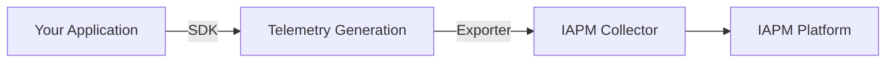

# Instrumentation

{!template/subscription-required.mdp!}

Instrumentation is the process of adding code to your application to generate telemetry data-traces, metrics, and logs. This data provides visibility into how your application behaves in production.

## How Instrumentation Works



When you instrument an application:

1. **Add the SDK** - Include the instrumentation library in your application
2. **Configure exporters** - Tell the SDK where to send telemetry data
3. **Deploy** - Run your instrumented application
4. **Observe** - View telemetry data in IAPM

## Instrumentation Types

### Automatic Instrumentation

Many frameworks and libraries can be instrumented automatically without code changes:

| What's Captured | Examples |
|-----------------|----------|
| HTTP requests | Incoming/outgoing API calls |
| Database queries | SQL, MongoDB, Redis operations |
| Message queues | RabbitMQ, Kafka producers/consumers |
| Framework events | ASP.NET, Express.js, Spring Boot |

**Benefits:**

- No code changes required
- Quick to implement
- Captures common operations automatically

### Manual Instrumentation

Add custom instrumentation for business-specific operations:

```csharp
// Example: Custom span for business logic
using var span = tracer.StartActiveSpan("ProcessOrder");
span.SetAttribute("order.id", orderId);
span.SetAttribute("order.total", orderTotal);
// ... your business logic
```

**Benefits:**

- Capture business-specific context
- Add custom attributes and events
- Instrument proprietary code

## OpenTelemetry Integration

IAPM uses [OpenTelemetry](../Observability/Frameworks/OpenTelemetry/index.md) as its instrumentation standard. OpenTelemetry provides:

- **Vendor-neutral APIs** - No lock-in to specific platforms
- **Broad language support** - .NET, Java, Python, Node.js, Go, and more
- **Rich ecosystem** - Automatic instrumentation for popular frameworks
- **Active community** - Continuous improvements and updates

## Getting Started

1. **Choose your language** - Find the OpenTelemetry SDK for your platform
2. **Add dependencies** - Include the SDK and auto-instrumentation packages
3. **Configure the exporter** - Point telemetry to your IAPM endpoint
4. **Verify data flow** - Confirm telemetry appears in IAPM

For detailed setup instructions, see the [OpenTelemetry documentation](https://opentelemetry.io/docs/concepts/instrumentation/).

## Next Steps

- Learn about [Collection](../Collection/index.md) - How telemetry data is gathered and transmitted
- Understand [Correlation](../Correlation/index.md) - How related telemetry is connected
- Explore [OpenTelemetry](../Observability/Frameworks/OpenTelemetry/index.md) - Deep dive into the framework
