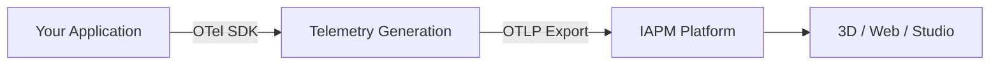

# Instrumentation

Instrumentation is the process of adding code to your application to generate telemetry data - traces, metrics, and logs. IAPM uses [OpenTelemetry](../Observability/Frameworks/OpenTelemetry/index.md) as its instrumentation standard.

!!! tip "Looking for setup instructions?"
    For step-by-step instrumentation guides with code examples for your language, see the **[Instrument Your Application](../../../Instrument/index.md)** section.

## How It Works

```mermaid
graph LR
    A[Your Application] -->|OTel SDK| B[Telemetry Generation]
    B -->|OTLP Export| C[IAPM Platform]
    C --> D[3D / Web / Studio]
```

1. **Add the SDK** - Include OpenTelemetry packages for your language
2. **Configure the exporter** - Point to `https://otlp.iapm.app` with your API key
3. **Deploy** - Run your instrumented application
4. **Observe** - View telemetry in IAPM within minutes

## Automatic vs Manual

| Approach | When to Use | Effort |
|----------|-------------|--------|
| **Auto-instrumentation** | HTTP, database, messaging frameworks | Zero code changes |
| **Manual instrumentation** | Business logic, custom attributes, domain events | Add spans in your code |

Most teams start with auto-instrumentation and add manual spans where business context matters.

## Language Guides

| Language | Guide |
|----------|-------|
| .NET / C# | [.NET Guide](../../../Instrument/dotnet/index.md) |
| Java | [Java Guide](../../../Instrument/java/index.md) |
| Python | [Python Guide](../../../Instrument/python/index.md) |
| Node.js | [Node.js Guide](../../../Instrument/nodejs/index.md) |
| Go | [Go Guide](../../../Instrument/go/index.md) |
| Kubernetes | [Kubernetes Guide](../../../Instrument/kubernetes/index.md) |
| OTel Collector | [Collector Guide](../../../Instrument/collector/index.md) |

## Next Steps

- Learn about [Collection](../Collection/index.md) - How telemetry data is gathered and transmitted
- Understand [Correlation](../Correlation/index.md) - How related telemetry is connected
- Explore [OpenTelemetry](../Observability/Frameworks/OpenTelemetry/index.md) - The framework IAPM is built on
