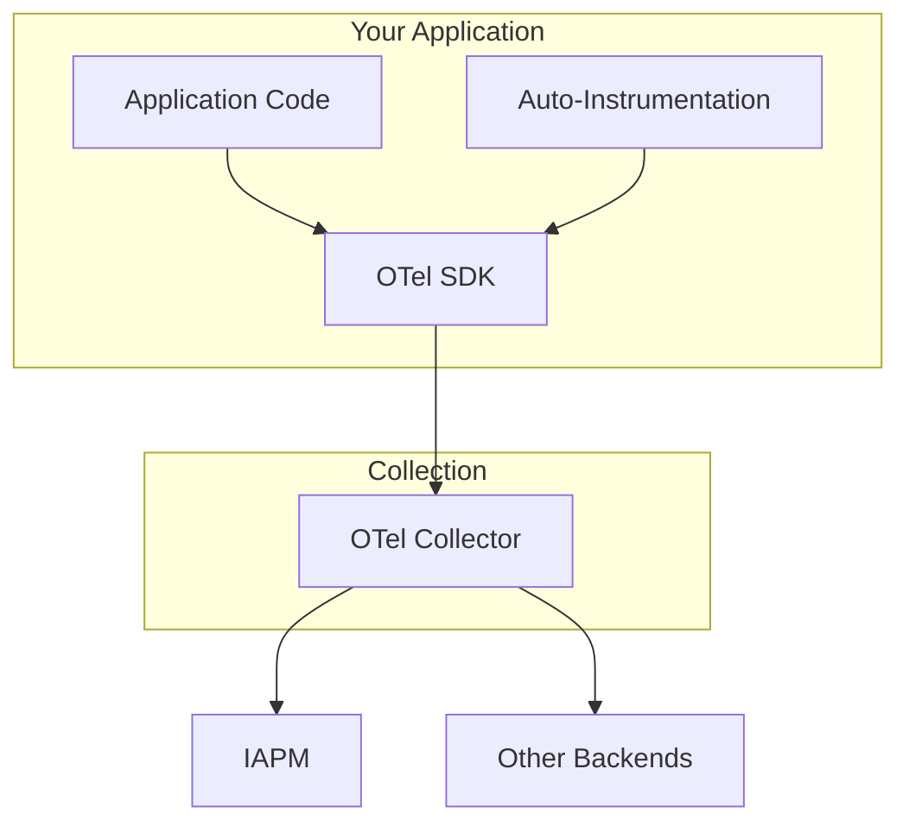

# OpenTelemetry

{:style="height:100px; float:right"}

[OpenTelemetry](https://opentelemetry.io/) (OTel) is the industry-standard framework for [observability](../../index.md). It provides vendor-neutral APIs, SDKs, and tools for generating, collecting, and exporting telemetry data. IAPM uses OpenTelemetry as its primary instrumentation framework.

## Why OpenTelemetry?

| Benefit | Description |
|---------|-------------|
| **Vendor Neutral** | No lock-in-switch backends without changing instrumentation |
| **Comprehensive** | Single framework for traces, metrics, and logs |
| **Industry Backed** | CNCF project with support from major cloud providers |
| **Active Ecosystem** | Rich library of auto-instrumentation for popular frameworks |

## Architecture



## Core Components

### API

The API defines how to create telemetry:

- **Tracer** - Creates spans for distributed tracing
- **Meter** - Records metrics (counters, gauges, histograms)
- **Logger** - Emits structured log events

### SDK

The SDK implements the API with:

- **Processors** - Transform telemetry before export
- **Exporters** - Send data to backends (OTLP, Jaeger, etc.)
- **Samplers** - Control which traces are recorded

### Collector

The OpenTelemetry Collector is a standalone service that:

- **Receives** telemetry from multiple sources
- **Processes** data (filtering, enrichment, batching)
- **Exports** to one or more backends

## Language Support

OpenTelemetry provides SDKs for major programming languages:

| Language | Traces | Metrics | Logs | Auto-Instrumentation |
|----------|--------|---------|------|---------------------|
| .NET | Stable | Stable | Stable | Yes |
| Java | Stable | Stable | Stable | Yes |
| Python | Stable | Stable | Stable | Yes |
| Node.js | Stable | Stable | Experimental | Yes |
| Go | Stable | Stable | Stable | Limited |
| Rust | Stable | Alpha | Alpha | Limited |

## Auto-Instrumentation

OpenTelemetry can automatically instrument common libraries and frameworks:

### .NET Example

```csharp
// Add packages
// OpenTelemetry.Instrumentation.AspNetCore
// OpenTelemetry.Instrumentation.Http
// OpenTelemetry.Instrumentation.SqlClient

services.AddOpenTelemetry()
    .WithTracing(builder => builder
        .AddAspNetCoreInstrumentation()
        .AddHttpClientInstrumentation()
        .AddSqlClientInstrumentation()
        .AddOtlpExporter());
```

### What Gets Instrumented Automatically

| Category | Examples |
|----------|----------|
| Web Frameworks | ASP.NET Core, Express, Spring Boot, Django |
| HTTP Clients | HttpClient, Axios, requests |
| Databases | SQL Server, PostgreSQL, MongoDB, Redis |
| Message Queues | RabbitMQ, Kafka, Azure Service Bus |
| Cloud SDKs | AWS SDK, Azure SDK, GCP SDK |

## Manual Instrumentation

Add custom spans for business logic:

```csharp
using var span = tracer.StartActiveSpan("ProcessPayment");
span.SetAttribute("payment.amount", amount);
span.SetAttribute("payment.currency", currency);

try
{
    // Business logic here
    span.SetStatus(Status.Ok);
}
catch (Exception ex)
{
    span.SetStatus(Status.Error);
    span.RecordException(ex);
    throw;
}
```

## OTLP Protocol

OpenTelemetry Protocol (OTLP) is the native protocol for transmitting telemetry:

- **Transport** - gRPC or HTTP/JSON
- **Encoding** - Protocol Buffers (efficient) or JSON (human-readable)
- **Ports** - 4317 (gRPC), 4318 (HTTP)

IAPM supports OTLP natively for optimal performance.

## Getting Started with IAPM

1. **Install the SDK** for your language
2. **Add auto-instrumentation** packages
3. **Configure the OTLP exporter** to point to IAPM
4. **Deploy** and verify data flows

For detailed setup instructions, see the [OpenTelemetry documentation](https://opentelemetry.io/docs/).

## Resources

- [OpenTelemetry Documentation](https://opentelemetry.io/docs/)
- [OpenTelemetry Registry](https://opentelemetry.io/ecosystem/registry/) - Find instrumentation libraries
- [OpenTelemetry Collector](https://opentelemetry.io/docs/collector/) - Deployment patterns

## Next Steps

- Learn about [Instrumentation](../../../Instrumentation/index.md) concepts
- Understand [Collection](../../../Collection/index.md) and data flow
- See how [Correlation](../../../Correlation/index.md) connects telemetry
