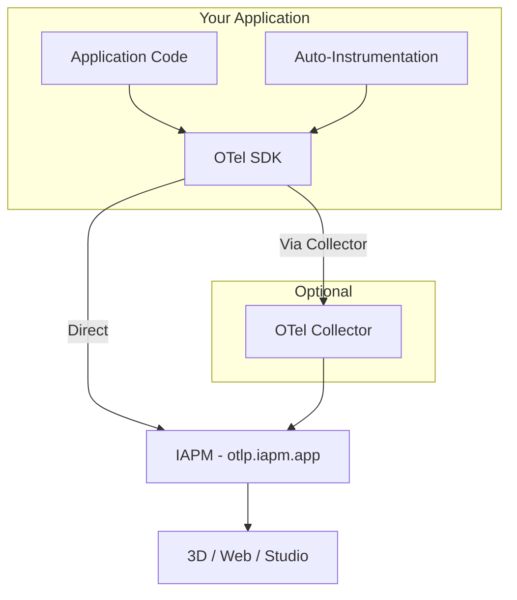

# OpenTelemetry

[OpenTelemetry](https://opentelemetry.io/){ target="_blank" } (OTel) is the vendor-neutral observability framework that IAPM is built on. IAPM is **OpenTelemetry-exclusive** - no proprietary agents, no vendor lock-in. Your instrumentation works with any OTel-compatible backend.

## Why IAPM Chose OpenTelemetry

| Reason | What It Means for You |
|--------|----------------------|
| **No proprietary agent** | Nothing to install beyond standard OTel SDKs |
| **No lock-in** | Switch backends or run IAPM alongside other tools |
| **Industry standard** | CNCF project backed by every major cloud provider |
| **One framework** | Traces, metrics, and logs through a single SDK |

## IAPM + OpenTelemetry Architecture


```mermaid
graph TD
    subgraph "Your Application"
        A[Application Code]
        B[OTel SDK]
        C[Auto-Instrumentation]
    end

    subgraph "Optional"
        D[OTel Collector]
    end

    A --> B
    C --> B
    B -->|Direct| E[IAPM - otlp.iapm.app]
    B -->|Via Collector| D
    D --> E
    E --> F[3D / Web / Studio]
```

You can export directly to IAPM or route through an [OpenTelemetry Collector](../../../../../Instrument/collector/index.md) for batching, filtering, or multi-backend fan-out.

## IAPM Configuration

All you need is the OTLP endpoint and your API key:

| Setting | Value |
|---------|-------|
| **Endpoint** | `https://otlp.iapm.app` |
| **Protocol** | OTLP/gRPC (port 443) or OTLP/HTTP |
| **Auth Header** | `API-Key: YOUR-API-KEY` |

```bash
# Environment variables - works with any OTel SDK
export OTEL_EXPORTER_OTLP_ENDPOINT=https://otlp.iapm.app
export OTEL_EXPORTER_OTLP_HEADERS="API-Key=YOUR-API-KEY"
```

For per-language setup, see the [Instrumentation Guides](../../../../../Instrument/index.md).

## Language Support

| Language | Traces | Metrics | Logs | Auto-Instrumentation |
|----------|--------|---------|------|---------------------|
| .NET | Stable | Stable | Stable | Yes |
| Java | Stable | Stable | Stable | Yes |
| Python | Stable | Stable | Stable | Yes |
| Node.js | Stable | Stable | Experimental | Yes |
| Go | Stable | Stable | Stable | Limited |

## Key Concepts

### OTLP Protocol

OpenTelemetry Protocol (OTLP) is the wire format IAPM natively supports:

- **gRPC** (port 4317) - Best performance, binary encoding
- **HTTP/protobuf** (port 4318) - Firewall-friendly alternative

IAPM accepts both on port 443 with TLS.

### Sampling

Not every request needs to be traced. OTel supports:

- **Head sampling** - Decide at request start (ParentBased, TraceIdRatio)
- **Tail sampling** - Decide after the trace completes (via Collector)

For IAPM throughput limits by plan, see [Plans & Pricing](../../../../../Setup/Plans/index.md).

## Further Reading

- [OpenTelemetry Documentation](https://opentelemetry.io/docs/){ target="_blank" }
- [OpenTelemetry Registry](https://opentelemetry.io/ecosystem/registry/){ target="_blank" } - Find instrumentation libraries
- [IAPM Instrumentation Guides](../../../../../Instrument/index.md) - Step-by-step setup

## Next Steps

- [Instrument your application](../../../../../Instrument/index.md)
- Learn about [Collection](../../../Collection/index.md) and data flow
- See how [Correlation](../../../Correlation/index.md) connects telemetry
