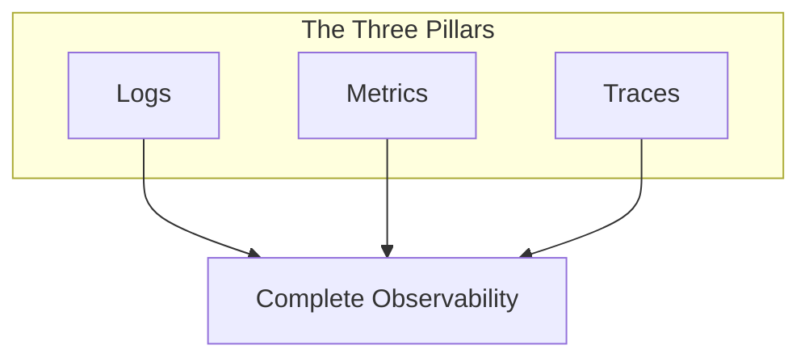

# Observability

Observability is the ability to understand a system's internal state by examining its external outputs. Unlike traditional monitoring that tells you *when* something is wrong, observability helps you understand *why* it's wrong—even for problems you've never seen before.

## The Three Pillars

Observability is built on three complementary data types, each providing a different perspective on system behavior:



### Logs

**What they are:** Timestamped records of discrete events that happened in your system.

**Best for:**

- Debugging specific errors and exceptions
- Audit trails and compliance
- Understanding application behavior at a granular level

**Example:**

```text
2024-01-15T10:23:45Z ERROR [PaymentService] Failed to process payment for order #12345: Card declined
```

### Metrics

**What they are:** Numeric measurements collected at regular intervals.

**Best for:**

- Tracking trends over time
- Setting up alerts and thresholds
- Capacity planning and resource optimization

**Common metrics:**

| Metric Type | Examples |
|-------------|----------|
| Counters | Request count, error count |
| Gauges | CPU usage, memory utilization, queue depth |
| Histograms | Response time distribution, payload sizes |

### Traces

**What they are:** Records of requests as they flow through distributed systems.

**Best for:**

- Understanding request flow across services
- Identifying latency bottlenecks
- Debugging distributed system issues

**Example trace:**

```text
User Request
  └─ API Gateway (5ms)
      └─ Auth Service (12ms)
      └─ Order Service (45ms)
          └─ Database Query (30ms)
          └─ Payment Service (200ms) ← bottleneck!
```

## How the Pillars Work Together

Each pillar provides unique insights, but the real power comes from correlating them:

| Scenario | Start With | Then Use |
|----------|------------|----------|
| "Response times are slow" | Metrics (latency dashboard) | Traces (find slow spans) |
| "Error rate is spiking" | Metrics (error rate alert) | Logs (error details) |
| "Request failed" | Traces (failed span) | Logs (exception stack trace) |

## Observability vs. Monitoring

| Aspect | Traditional Monitoring | Observability |
|--------|------------------------|---------------|
| Approach | Predefined checks | Exploratory analysis |
| Questions | Known unknowns | Unknown unknowns |
| Data | Aggregated metrics | High-cardinality data |
| Debugging | Dashboard-driven | Query-driven |

## Benefits of Observability

### Faster Incident Resolution

With correlated telemetry data, teams can quickly trace issues from symptoms to root causes without guessing or extensive log searching.

### Proactive Problem Detection

Identify anomalies and degradation before they impact users through intelligent alerting and trend analysis.

### Better Collaboration

A shared observability platform gives developers, operations, and SRE teams a common view of system health, improving communication and reducing finger-pointing.

### Data-Driven Decisions

Make informed decisions about architecture, scaling, and optimization based on actual system behavior rather than assumptions.

## Frameworks

IAPM supports industry-standard observability frameworks:

- **[OpenTelemetry](Frameworks/OpenTelemetry/index.md)** - The vendor-neutral standard for instrumentation

## Next Steps

- Learn how to add [Instrumentation](../Instrumentation/index.md) to your applications
- Understand how [Collection](../Collection/index.md) gathers telemetry data
- See how [Correlation](../Correlation/index.md) connects your observability data
