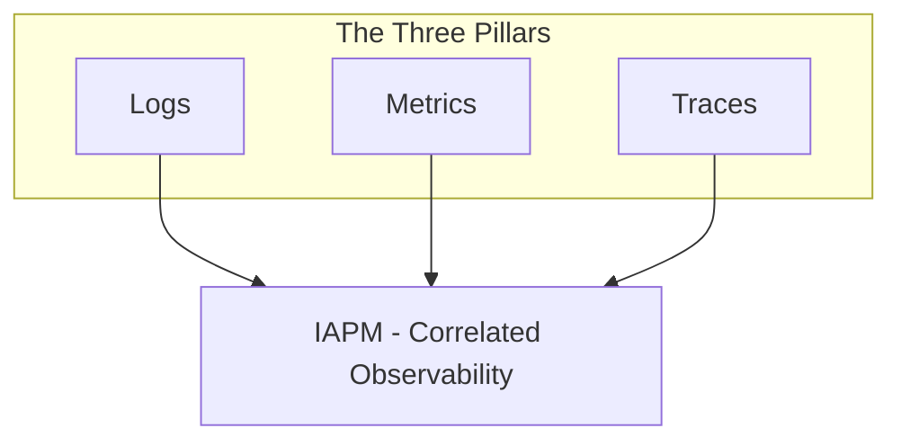

# Observability

Observability is the ability to understand a system's internal state by examining its external outputs. Unlike traditional monitoring that tells you *when* something is wrong, observability helps you understand *why* - even for problems you've never seen before.

IAPM brings observability into 3D space. Instead of switching between dashboards, fly through your service topology and ask Tessa to explain what's happening.

## The Three Pillars

```mermaid
graph TD
    subgraph "The Three Pillars"
        L[Logs]
        M[Metrics]
        T[Traces]
    end
    L --> O[IAPM - Correlated Observability]
    M --> O
    T --> O
```

### Traces

Records of requests as they flow through distributed systems. In IAPM, traces are visualized as 3D structures in the Diagnostics Room - you can walk through a request's journey across services.

**Best for:** Understanding request flow, identifying latency bottlenecks, debugging distributed failures.

### Metrics

Numeric measurements collected at regular intervals - counters, gauges, and histograms. IAPM renders metrics as real-time graphs on the Grid surface.

**Best for:** Tracking trends, setting alert thresholds, capacity planning.

### Logs

Timestamped records of discrete events. IAPM correlates logs with their parent traces, so you can jump from a failed span directly to the error log.

**Best for:** Debugging specific errors, audit trails, understanding application behavior at a granular level.

## How the Pillars Work Together in IAPM

The real power is correlation - connecting signals across pillars:

| You Notice | Start With | Then Use | IAPM Experience |
|------------|-----------|----------|-----------------|
| "Response times are slow" | Metrics (latency graph) | Traces (find slow spans) | Ask Tessa: "Why is the order service slow?" |
| "Error rate is spiking" | Metrics (error rate alert) | Logs (error details) | Tessa correlates alerts with root cause |
| "Request failed" | Traces (failed span) | Logs (exception stack trace) | Click the span, see the log inline |

## OpenTelemetry

IAPM uses [OpenTelemetry](Frameworks/OpenTelemetry/index.md) as its sole instrumentation framework. One SDK captures all three pillars - no separate agents for logs vs traces vs metrics.

## Next Steps

- Learn how to [instrument your application](../../../Instrument/index.md) with OpenTelemetry
- Understand how [Collection](../Collection/index.md) gathers telemetry data
- See how [Correlation](../Correlation/index.md) connects signals across pillars
