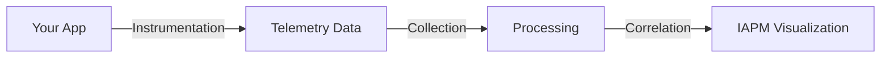

# Terms and Concepts

Understanding the terminology and concepts behind application performance monitoring is essential for getting the most out of IAPM. This guide covers everything from foundational APM concepts to advanced observability techniques.

## Core Concepts

Build your foundation with these essential concepts:

| Concept | Description |
|---------|-------------|
| [APM](APM/index.md) | Application Performance Management fundamentals and why they matter |
| [Observability](Observability/index.md) | The three pillars: logs, metrics, and traces |
| [IAPM](IAPM/index.md) | How immersive 3D/VR visualization transforms APM |

## Data Pipeline

Understand how telemetry flows from your application to actionable insights:

| Stage | Description |
|-------|-------------|
| [Instrumentation](Instrumentation/index.md) | Adding telemetry capture to your application code |
| [Collection](Collection/index.md) | Gathering, buffering, and transmitting telemetry data |
| [Correlation](Correlation/index.md) | Connecting related traces, logs, and metrics together |

## Frameworks

IAPM integrates with industry-standard observability frameworks:

| Framework | Description |
|-----------|-------------|
| [OpenTelemetry](Observability/Frameworks/OpenTelemetry/index.md) | The vendor-neutral observability standard we support |
