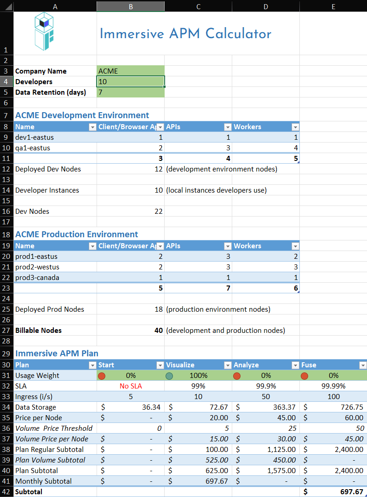

# Pricing Calculator

Estimate your monthly IAPM subscription costs with our interactive calculator. Make a copy to your preferred location and adjust the inputs to match your requirements.

## Get the Calculator

[Excel Spreadsheet :material-microsoft-excel:](https://docs.google.com/spreadsheets/d/1t5tnafX0khdi0wWvi195TfmtfWwXq-vf/edit?usp=sharing&ouid=117302896292116417792&rtpof=true&sd=true){ .md-button target="_blank" }
[Google Sheets :material-google-spreadsheet:](https://docs.google.com/spreadsheets/d/1eR7-TftjKlR2urxYcvemoam__8t-Whxn9QLB1w7eSgk/edit?usp=sharing){ .md-button target="_blank" }

## How to Use

1. **Open the calculator** using one of the links above
2. **Make a copy** to your Google Drive or download the Excel file
3. **Enter your parameters:**
    - Number of developers/users
    - Data retention period
    - Number of environments
    - Expected telemetry volume
4. **Review the estimated cost** based on your inputs

## Example Calculation

Here's a sample calculation for a mid-sized development team:

!!! example "ACME Company Scenario"

    | Parameter | Value |
    |-----------|-------|
    | Software developers | 10 |
    | Data retention | 7 days |
    | Development environments | 2 |
    | Production environments | 3 |

    

## Understanding Usage Weight

Usage weight helps you model mixed-plan scenarios:

| Scenario | Visualize | Analyze |
|----------|-----------|---------|
| Visualize only | 100% | 0% |
| Analyze only | 0% | 100% |
| Mixed usage | 50% | 50% |

!!! tip "Usage Weight"
    Adjust the usage weight percentages to reflect how your team will use different IAPM features. This helps generate a more accurate cost estimate for mixed workloads.

## Discounts and Promotions

We offer discounts for:

- **Annual commitments** - Save with yearly billing
- **Startups** - Special pricing for early-stage companies
- **Non-profits** - Reduced rates for qualifying organizations
- **Education** - Academic pricing available

Check our [Discord community](https://discord.gg/UhSAUHAW){ target="_blank" } for current promotions and discount codes.

## Need Help?

Having trouble with the calculator or need a custom quote?

- **Chat with us** - Use the chat widget on our website
- **Join Discord** - [discord.gg/zevywnQp6K](https://discord.gg/zevywnQp6K){ target="_blank" }
- **Email sales** - [sales@immersivefusion.com](mailto:sales@immersivefusion.com)
