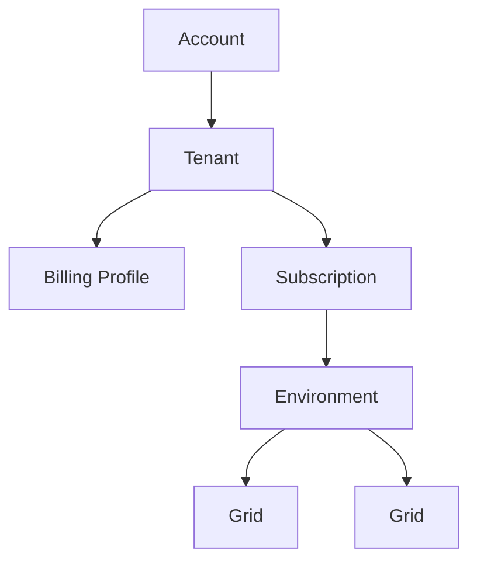

# Account Configuration

{!template/subscription-management.mdp!}

Configure your IAPM account structure to organize telemetry data and manage billing.

## Account Hierarchy

## Setup Steps

### New Customers

| Step | Action | Description |
|------|--------|-------------|
| 1 | [Choose a plan](https://www.immersivefusion.com/pricing){ target="_blank" } | Select the subscription tier that fits your needs |
| 2 | Create a tenant | Set up your organizational unit |
| 3 | Add billing profile | Configure payment method |
| 4 | Activate subscription | Start your plan |

### All Customers

| Step | Action | Description |
|------|--------|-------------|
| 1 | Create environment | Organize by deployment stage (dev, prod) |
| 2 | Create grid | Add your application's telemetry container |

## Account Components

### Account

Your organization's identity in IAPM. Contains all tenants, subscriptions, and data.

### Tenant

An organizational unit within your account. Use tenants to separate:

- Different companies (for agencies/MSPs)
- Business units or departments
- Cost centers

### Billing Profile

Payment configuration for a tenant:

- Payment method (credit card, invoice)
- Billing address
- Tax information

### Subscription

Your IAPM plan. Determines:

| Aspect | Description |
|--------|-------------|
| **Features** | Available capabilities |
| **Data retention** | How long telemetry is stored |
| **Support level** | Response time guarantees |
| **Billing cycle** | Monthly or annual |

[View pricing plans](https://immersivefusion.com/pricing){ target="_blank" }

### Environment

A logical grouping of applications. Common patterns:

| Environment | Purpose |
|-------------|---------|
| Development | Local and CI/CD testing |
| Staging | Pre-production validation |
| Production | Live customer-facing systems |

### Grid

A container for a single application's telemetry data. Each grid has:

- Unique API key for instrumentation
- Separate data storage
- Independent retention settings

## Managing Your Account

| Task | Location |
|------|----------|
| View/edit tenant | Billing → Tenants |
| Update billing | Billing → Billing Profiles |
| Manage subscription | Billing → Subscriptions |
| Create environment | Applications → Environments |
| Create grid | Applications → Grids |

## Next Steps

[Get Started :material-arrow-right:](../../Getting-Started/index.md){ .md-button .md-button--primary }
[Get API Key :material-key:](../Api-Key/index.md){ .md-button }
