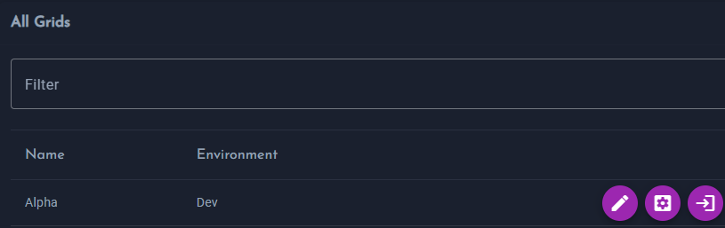

# API Keys

{!template/subscription-management.mdp!}

{!template/subscription-required.mdp!}

API keys authenticate your application's telemetry data with IAPM. Each grid has its own unique API key.

## Getting Your API Key

1. Log in at [portal.iapm.app](https://portal.iapm.app){ target="_blank" }, then go to **Administration → Grids**
2. Click the **Instrument** button (:material-cog:) on your grid
3. Copy your API key from the wizard

## API Key Properties

| Property | Description |
|----------|-------------|
| **Scope** | One API key per grid |
| **Format** | UUID string |
| **Header** | `API-Key` |
| **Endpoint** | `https://otlp.iapm.app` |

!!! warning "One API Key Per Application"
    Each application grid must have its own unique API key. Using the same key for multiple applications will mix telemetry data together, making it difficult to analyze.

## Using Your API Key

Configure your OpenTelemetry exporter with your API key:

| Setting | Value |
|---------|-------|
| **Endpoint** | `https://otlp.iapm.app` |
| **Header** | `API-Key: YOUR-API-KEY` |

See [Instrument Your Application](../Custom-application/Instrument-your-application/index.md) for language-specific examples.

## Security Best Practices

| Practice | Description |
|----------|-------------|
| **Don't commit to source control** | Use environment variables or secrets management |
| **Rotate periodically** | Generate new keys if compromised |
| **Use separate keys per environment** | Different keys for dev, staging, production |

## Regenerating API Keys

If an API key is compromised:

1. Go to your grid settings
2. Click **Regenerate API Key**
3. Update your application configuration
4. Deploy the change

!!! note "Key Rotation"
    After regenerating, the old key is immediately invalidated. Update your applications promptly to avoid data loss.

## Next Steps

[Instrument Your Application :material-arrow-right:](../Custom-application/Instrument-your-application/index.md){ .md-button .md-button--primary }
[View Best Practices :material-book-open:](../Best-Practices/index.md){ .md-button }
