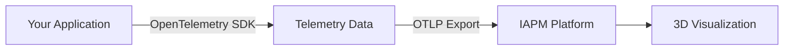
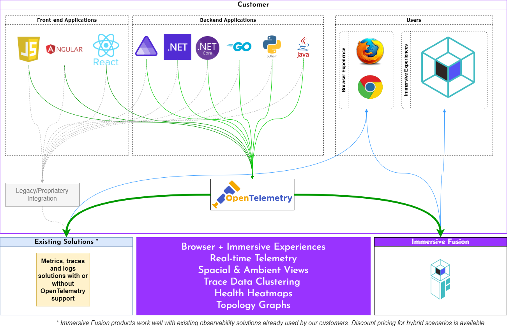

# Custom Application

Instrument any application with OpenTelemetry to visualize and analyze it in IAPM.

## What You Can Instrument

| Application Type | Description |
|------------------|-------------|
| **Your own code** | Applications built by you or your organization |
| **Open source** | Community projects and frameworks |
| **Commercial software** | Purchased applications with instrumentation support |

## How It Works

## Showcase: .NET Aspire Integration

See IAPM in action with a .NET Aspire application:

<iframe width="1024" height="576" src="https://www.youtube.com/embed/v5I3ljT8zgU?start=3" title="YouTube video player" frameborder="0" allow="accelerometer; autoplay; clipboard-write; encrypted-media; gyroscope; picture-in-picture; web-share" referrerpolicy="strict-origin-when-cross-origin" allowfullscreen></iframe>

## Next Steps

| Step | Description |
|------|-------------|
| **1. Get API Key** | [Obtain your grid's API key](../Api-Key/index.md) |
| **2. Instrument** | [Add OpenTelemetry to your application](Instrument-your-application/index.md) |
| **3. Best Practices** | [Follow instrumentation guidelines](../Best-Practices/index.md) |

[Instrument Your Application :material-arrow-right:](Instrument-your-application/index.md){ .md-button .md-button--primary }
[View Best Practices :material-book-open:](../Best-Practices/index.md){ .md-button }
