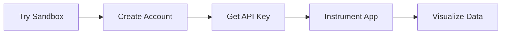

# Setup

Configure your IAPM environment, manage your account, and connect your applications.

## Setup Guides

| Guide | Description |
|-------|-------------|
| [Sandbox](Sandbox/index.md) | Try IAPM with pre-loaded demo data |
| [Login](Login/index.md) | Authentication options (Entra ID, Local/Social) |
| [Account](Account/index.md) | Account structure and configuration |
| [API Key](Api-Key/index.md) | Generate and manage API keys |
| [Custom Application](Custom-application/index.md) | Instrument your applications |
| [Best Practices](Best-Practices/index.md) | OpenTelemetry configuration guidelines |

## Offers & Discounts

| Offer | Description |
|-------|-------------|
| [Azure Marketplace](Offers/Azure-Marketplace.md) | Purchase through Microsoft Azure |
| [Early Adopter](Discounts/Early-Adopter.md) | Special pricing for early customers |

## Quick Start Path

| Step | Action | Time |
|------|--------|------|
| 1 | [Try the Sandbox](Sandbox/index.md) - Explore with demo data | 5 min |
| 2 | [Create Account](Account/index.md) - Sign up and configure | 5 min |
| 3 | [Get API Key](Api-Key/index.md) - Generate credentials | 1 min |
| 4 | [Instrument App](Custom-application/index.md) - Add OpenTelemetry | 10-30 min |
| 5 | View data in [IAPM Desktop](../Products/IAPM-Desktop/index.md) or [IAPM Web](../Products/IAPM-Web/index.md) | Immediate |

## Account Structure

IAPM organizes your data in a hierarchy:

| Level | Purpose |
|-------|---------|
| **Account** | Your organization's IAPM identity |
| **Tenant** | Organizational unit (company, department) |
| **Environment** | Deployment stage (dev, staging, production) |
| **Grid** | Individual application's telemetry container |

See [Account Configuration](Account/index.md) for details.

## Next Steps

| Goal | Link |
|------|------|
| Explore without setup | [Sandbox](Sandbox/index.md) |
| Start with your app | [Instrumentation Guide](Custom-application/Instrument-your-application/index.md) |
| Learn best practices | [Best Practices](Best-Practices/index.md) |
