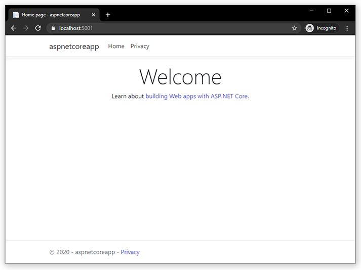
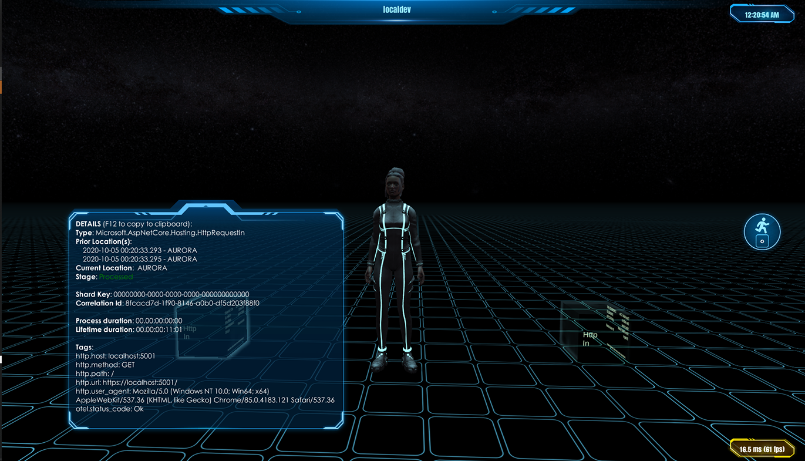

# ASP.NET Core

{!template/coming-soon.mdp!}

Level of effort: `low`

Time required: `15 minutes`

## Objectives

* Instrument a new ASP.Net Core web application. You can instrument existing applications just as easily.

## Before you begin

### Fusion Hub connection information

* [Trial or paid license](/getting-started)

### Required software

* [.NET Core SDK](https://dotnet.microsoft.com/download){target=prereq}
* Optional: [Visual Studio](https://visualstudio.microsoft.com/){target=prereq}
* [Get started with ASP.NET Core](https://docs.microsoft.com/en-us/aspnet/core/getting-started/){target=prereq}

### Create a web app project

Open Powershell and navigate to a folder where you would like to create the tutorial project.

!!! note "Follow the instructions in Get started with ASP.NET Core"
    The following `dotnet` commands are the same as in the tutorial. We will follow the same steps to create the project so that we are ready to begin instrumentation. Review the tutorial instructions if you have troubles with any of the preliminary steps.


=== "Powershell"

    ``` powershell

    # Create the application
    dotnet new webapp -o aspnetcoreapp

    # Trust  the development certificate
    dotnet dev-certs https --trust

    # Run the application
    cd aspnetcoreapp
    dotnet watch run
    ```

The output should look similar to the following:

```
watch : Started
Building...
info: Microsoft.Hosting.Lifetime[0]
      Now listening on: https://localhost:5001
```

Navigate to [http://localhost:5001](http://localhost:5001){target=aspnetcoreapp}. The result should look like the following:




## Add required packages

Open a *new* Powershell window and navigate inside of your `aspnetcoreapp` folder.

!!! warning "BETA packages"
    Packages for Open Telemetry are current in BETA.

Add the following packages to your newly created project.

### Open Telemetry packages

=== "Powershell"

    ``` powershell
    dotnet add package OpenTelemetry.Extensions.Hosting --prerelease
    dotnet add package OpenTelemetry.Instrumentation.AspNetCore --prerelease
    dotnet add package OpenTelemetry.Instrumentation.Http --prerelease
    ```

### Optional packages

If you have any SQL or Redis cache connections, add the following packages as well.

=== "Powershell"

    ``` powershell
    dotnet add package OpenTelemetry.Instrumentation.SqlClient --prerelease
    dotnet add package OpenTelemetry.Instrumentation.StackExchangeRedis --prerelease
    ```

### Immersive Fusion packages

Add the packages for direct connection to the Fusion Hub.

=== "Powershell"

    ``` powershell
    dotnet add package IF.APM.OpenTelemetry.Direct  --prerelease
    ```

## Update Start.cs

Add additional namespaces

=== "C#"

    ``` csharp hl_lines="1-4"
    using System;
    using IF.APM.Client.Direct;
    using IF.APM.OpenTelemetry.Direct.Trace;
    using OpenTelemetry.Trace;
    ```

Add the following to the ConfigureService method body.

=== "C#"

    ``` csharp hl_lines="5-24"
    public void ConfigureServices(IServiceCollection services)
    {
        services.AddRazorPages();

        services.AddOpenTelemetryTracing((builder) => builder
            .AddAspNetCoreInstrumentation()
            
            // optional
            //.AddSqlClientInstrumentation()

            .AddFusionExporter(fusionOptions =>
            {
                fusionOptions.DirectConnection = new DirectConnectionInformation
                {
                    Name = "Tutorial",
                    Uri = new Uri("FUSIONHUBURI"),
                    Tls = false, //set to 'true' in production
                    IgnoreTlsErrors = true, //set to 'false' in production
                    UserName = "YOURUSERNAME",
                    Password = "YOURPASSWORD",
                    Exchange = "YOUREXCHANGE"
                };
            })
        );
    }
    ```

## Ready to visualize

Congratulations! Your application is now instrumented.

If you still have a Powershell window with `dotnet watch run`, your application will be recompiled automatically.

When you navigate back to [http://localhost:5001](http://localhost:5001){target=aspnetcoreapp} trace data being sent to your Fusion Hub and attached Immersive APM 3D client.

The result would look like the following:



## Clean up

* Exit/close the Powershell windows
* Delete your `aspnetcoreapp` folder

## Next steps

* [Visualize](/visualize)