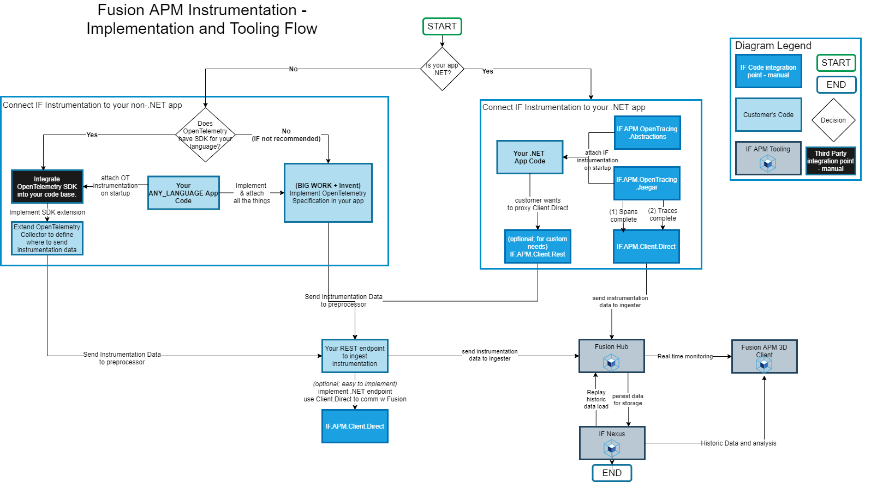

# Instrumentation Overview

{!template/subscription-required.mdp!}

{!template/coming-soon.mdp!}

Instrumentation is the process of extending your applications' codebase to capture and report real-time operations, stack traces, performance metrics, and much more automatically every time all or certain operations execute.

Instrumentation with Immersive APM can be nearly automatic or manual, depending on your needs. To get a deep insight into specific communication layers or a particularly important stack trace will require a small addition to your existing source code.

## Data flow

Instrumentation is the beginning of gaining immense visibility into your application using Immersive APM. After instrumentation is in place, all Traces and Spans with metadata will be sent to a central location called the Immersive Hub.

Depending on your license model, data sent to the Immersive Hub may be persisted and analyzed by a combination of real-time or post-processing modules that a cumulatively called the Nexus. Anyone using the [Immersive APM 3D client](/visualize/client-3d/) will see real-time application operations and metrics.

## Instrumentation Options

We are constantly improving our instrumentation options to be provide an effortless and intuitive experience. We provide ready-made packages for applications written in a variety of languages. We also provide a REST web service option if a package for your application is not yet available. Please [contact us](/contact.md) with questions or if you need assistance.

### Automatic Instrumentation / High Level

High-level instrumentation packages deliver an clean, out-of-the-box experience allowing for a streamlined way to get started. There is a little effort to get an application fully instrumented and operational.

### Manual Instrumentation / Low Level

Low-level instrumentation packages enable finer control but require more effort. Typical uses for low level hooks include but are not limited to high-throughput applications which may only need a subset of the trace data.

#### REST Endpoint Fall-back

We also offer a fall-back REST option for cases where the standard ways of connecting are not suitable. This may be due to firewall restrictions or the language of your application is not one we already have a high-level or a low-level instrumentation package for.