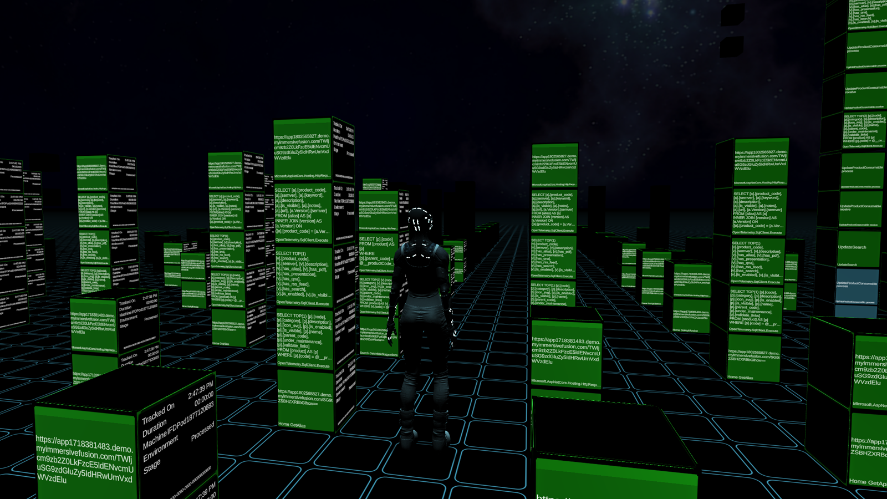

# Avatar

{!template/coming-soon.mdp!}

When you are using the Virtual Reality (VR) client provided by Immersive APM, you may view and interact with your application via your avatar.

Using the avatar, you may navigate and inspect all aspects of your application.    

