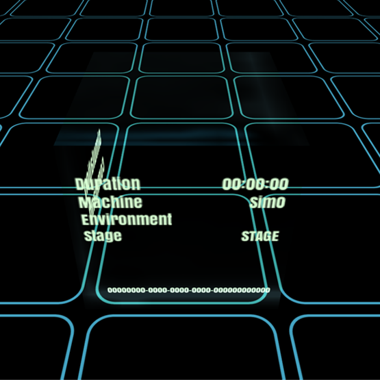

# Blocks

{!template/coming-soon.mdp!}

A block represents an activity occurring in your application, ecosystem or problem space. An 'activity' may be a simple atomic operation or a complex action that involves several state transitions.  As a single block represents a single operation (sometimes referred to as a trace), a stack of blocks represents logically related operations: click, reset a password, update UI. Related blocks form a stack and travel together.

=== "Block in flight"
    
=== "Block on the grid"
    

<!--
TODO: Describe the interaction with Nexus and the throughout graph at the top.
-->