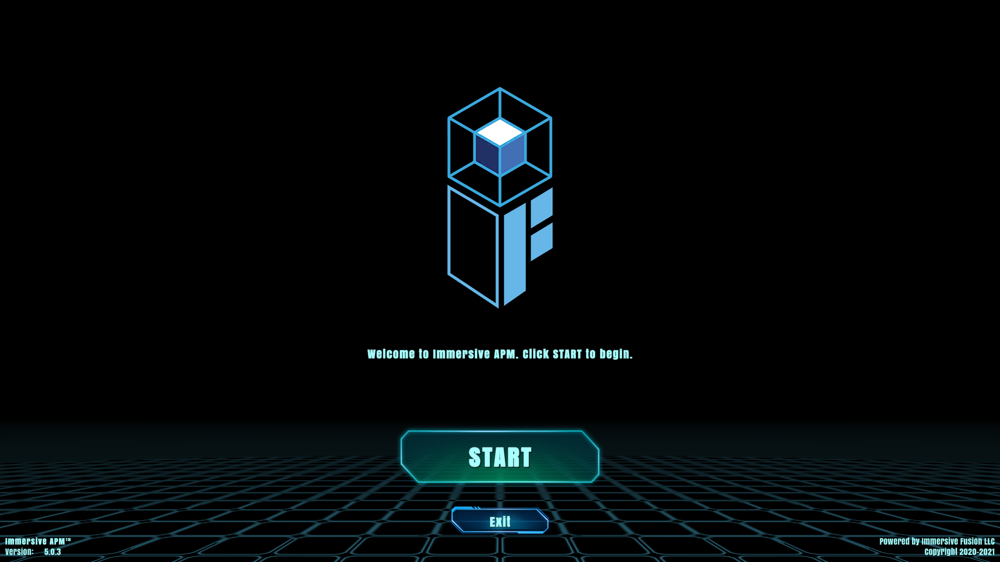
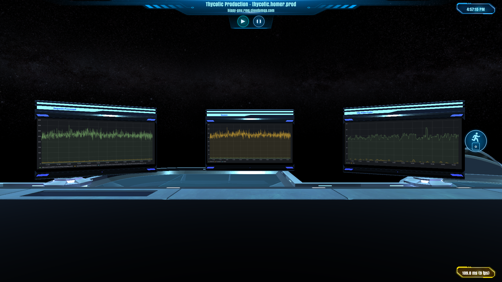
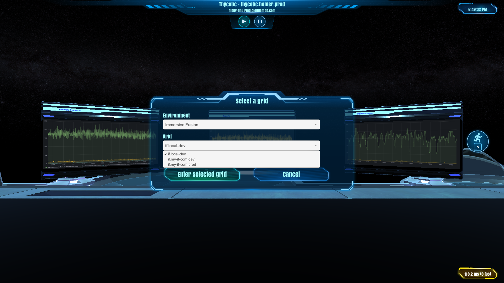

# Connection

{!template/subscription-required.mdp!}

After successfully installing the Immersive APM 3D-Client, you need to go through the following steps to start your experience. 

## How to Run Immersive APM 3D-Client

Please follow the given steps to run the application for the first time,

**Start Menu > Immersive APM** 

You will see the following screen,

Click on "Start Button", the system will redirect you to your web browser for authentication purposes. 

Please enter your registered account details here, and press **Sign In**
!!! note "You can close the browser after Sign In."

Now, your Immersive 3D-Client will look like as below:

The last step is to press F10 for connection information input

Please enter the connection information to any grid defined and accessible via your subscription. When all connection information is complete, press "Enter the Grid". Enjoy!

!!! note "Pro-tip"
    Pressing `F10` on your keyboard will bring up the connection screen.

