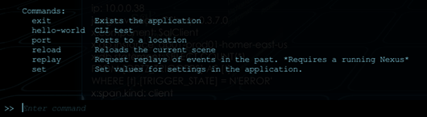

# Console Overview

Pressing tilde (~) while running the Immersive APM VR client will launch the console and provide you with a command line prompt. 
From the command line, you may enter any Immersive APM command to perform tasks inside the client.

To get a list of available commands, enter `--help`

Each command in explained via online help.  Online help may be displayed by entering the command followed by `--help`
