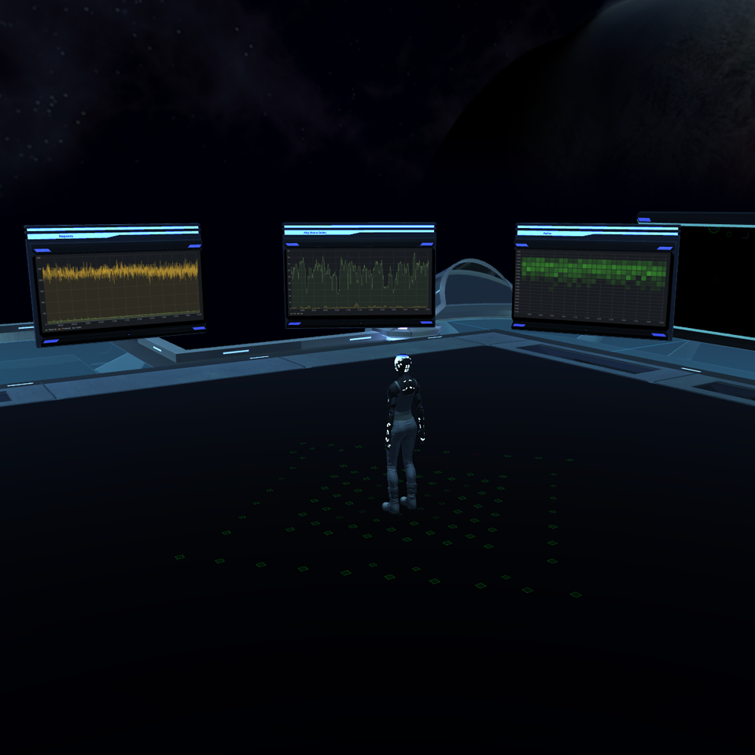

# Core

{!template/coming-soon.mdp!}

The Core  provides real-time dashboards highlighting key measures and metrics for your application and the supporting stack.

When interacting with the Core, users may interact with a variety of logs, reports and charts to better understand application execution.  

In addition to the visual experience provided by Immersive APM, all trace and log data is used to fuel our machine learning engine.  Over time, as Immersive APM learns about your application as to provide recommendations and issue resolutions. 

