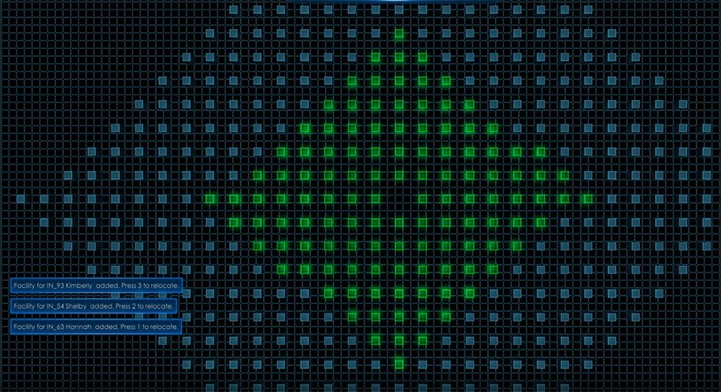
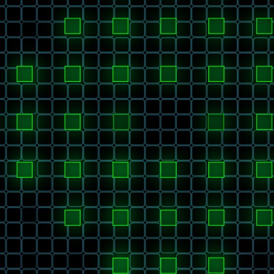

# Grid

{!template/coming-soon.mdp!}

The grid in Immersive APM shows application throughput and overall flow.  An empty grid means the application is idle.  A grid where operations turn green before they land is healthy.  Simple status colors give the grid its ambient meaning: a mix of green (success), orange (delay), red (error) is generally what one can expect in a live ecosystem.

!!! note "Pro-tip"
    Pressing `M` on your keyboard will toggle on/off the bird's-eye view of the grid.

!!! note "Pro-tip"
    Pressing `N` on your keyboard will toggle on/off topology view. 
    While in topology view, press `Tab` to enable fly-through.  Fly-through allows you to fly around and inspect different nodes.

=== "Birds-eye Empty grid / Idle application"
    

=== "Birds-eye Full grid / Active application"
    