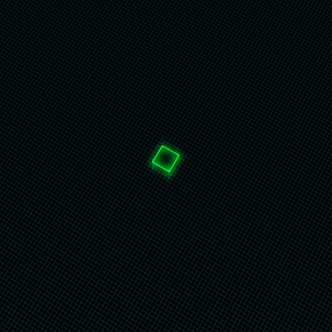

# Hyper Cubes

{!template/coming-soon.mdp!}

A hyper cube represents an action occurring in your application, ecosystem or problem space. An 'action' may be a simple atomic operation or a complex action that involves several state transitions.  As a single cube represents a single operation, a stack of cubes represents logically related operations: click, reset a password, update UI. Related cubes form a stack and travel together.

=== "Cube in flight"
    
=== "Cube on the grid"
    

<!--
TODO: Describe the interaction with Nexus and the throughout graph at the top.
-->