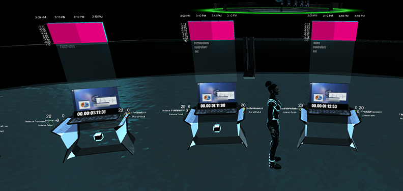

# Hyper Terminals

{!template/coming-soon.mdp!}

Hyper-terminals display a specific operation, in real time, while it is happening.  The hyper-terminal includes a real-time timer that displays the time that has elapsed since the operation was last active.  A hyper-terminal displays six operation specific metrics:  
(1) Instances Processed, 
(2) Instances Lost, 
(3) Instances Failed, 
(4) Overall Operations Processed, 
(5) Overall Operations Lost, and 
(6) Overall Operations Failed.

Users can teleport to follow, highlight, or filter out a corresponding hyper cube.

