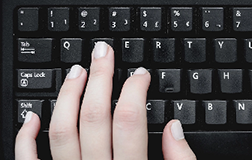

# Movement

{!template/coming-soon.mdp!}

## Keyboard navigation

Immersive APM provides navigation via conventional keyboard movement standards.  
Similar to any first-person exerience in a video game, you may navigate the grid using WASD navigation.

* W - forward
* A - left
* S - back
* D - right

Users can run by pressing and holding Shift in combination with the appropriate WASD key.  
Users may jump by pressing the Space bar.

## Mouse movement

Using the mouse wheel causes the camera to zoom in and out.

Holding down the right mouse button while moving the mouse causes the camera to rotate around the avatar.

Holding down the right mouse button while walking will cause the avatar to turn in the direction of the mouse.