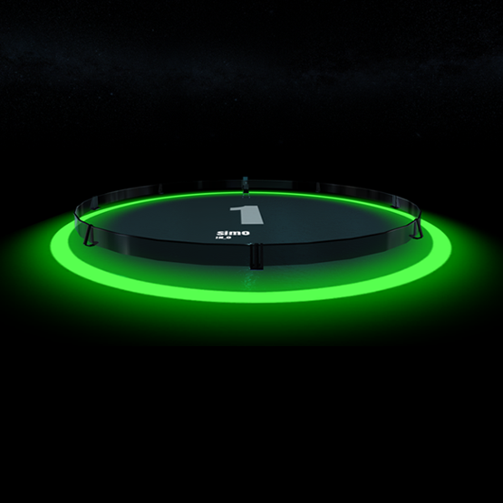
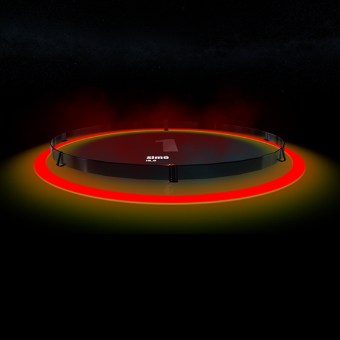
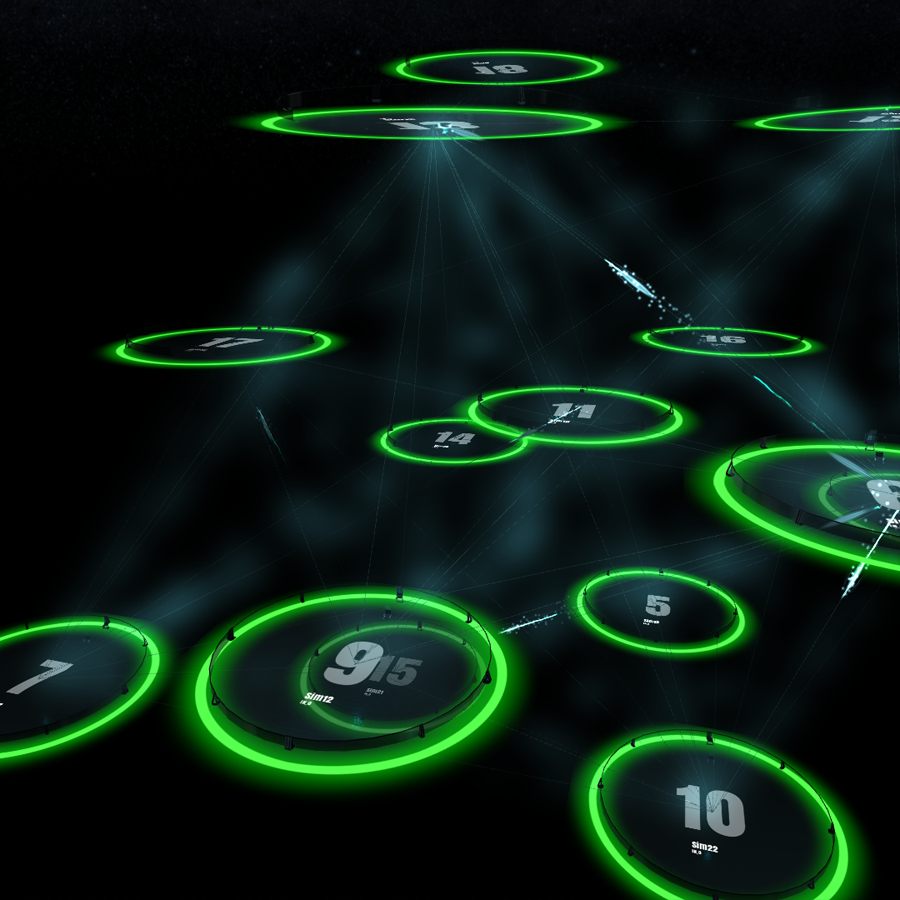

# Nodes

{!template/coming-soon.mdp!}

Each logical cluster of functionality in Immersive APM is considered a node. A virtual node can represent an entire server, a process or a collection of executing algorithms.

=== "Idle node"
    

=== "Active node"
    

=== "Node with errors"
    

## Topology View

If all virtual nodes are viewed via a top-down view, you will see the topology of your application. The formation and location of each node is driven by nodes communicating with each other and forming a DAG (Direct Acyclic Graph). Nodes that communicate with each other tend to gravitate closer to each other and ones that have been idle for a long time or get no traffic tend to float away.

!!! note "Pro-tip"
    Pressing `N` on your keyboard will toggle between a top-down and landscape topology view. 
    When viewing a node topology, if you press `Tab` you will enable fly-through, enabling flight from node to node.

=== "Perspective topology view"
