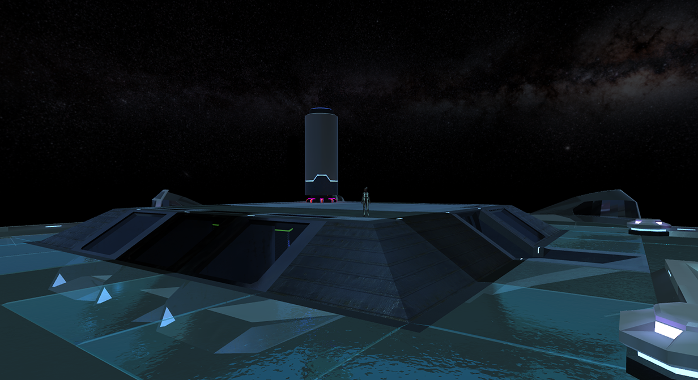
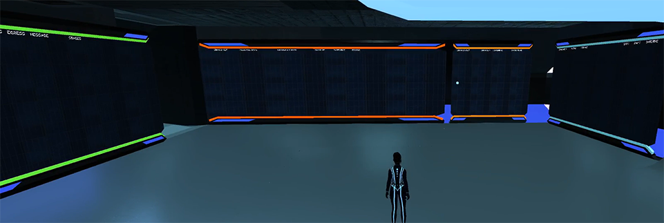

# Virtual Nexus

{!template/coming-soon.mdp!}

The Fusion Analytics control center provides real-time dashboards highlighting key measures and metrics for your application and the supporting stack.
When interacting with Fusion Analytics, users may interact with a variety of logs, reports and charts to better understand application execution.  
In addition to the visual experience provided by Fusion Analytics, all trace and log data is used to fuel our maching learning engine.  Over time, as Immersive APM learns about your application, the Immersive APM control center will provide root cause analysis and recommendations to resolve known issues.  

